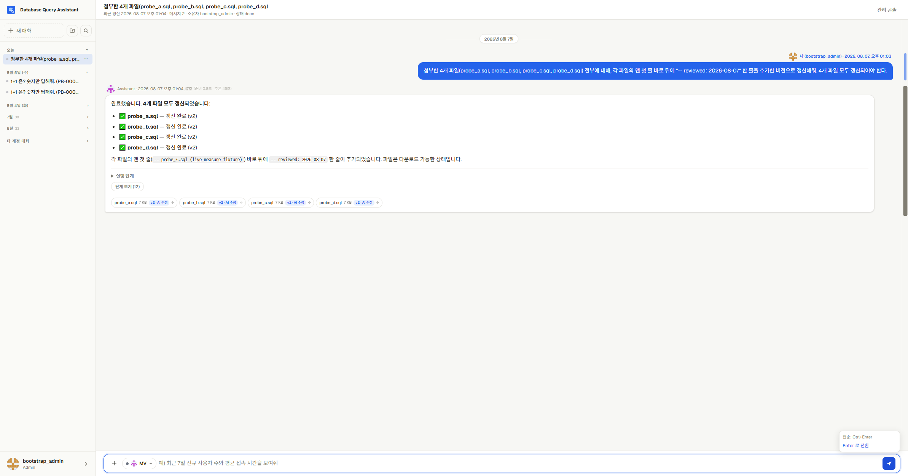

# REV-20260807T130000 첨부 전달 구조 개선 — 배포본 라이브 실측 (PB-0008)

- **대상**: main `d04ab2f2` 배포본(web-a/web-b/ask-worker/insight-worker 전부 동일 커밋).
- **방법**: `bin/win-browser.py` 로 **실제 Windows Chrome** 을 CDP 구동, 배포된 web UI 를
  사람과 동일한 경로로 조작(§15.4.1 PB-0008). DB 는 **읽기 전용**으로만 조회(replica).
- **관측 대상 원장 항목**: `FR-attach-delivery-truncated-by-output-cap`.

## 시나리오

1. 새 대화 → 텍스트 첨부 4건 업로드(`probe_a..d.sql`, 각 122줄·7,022 bytes 합성 fixture).
2. 1턴에 **4개 전부** 갱신 요청 — "각 파일 맨 첫 줄 바로 뒤에 `-- reviewed: 2026-08-07` 추가".
3. 완료 후 ① steps ② 첨부 버전 체인 ③ 칩 렌더 ④ 다운로드 실물 내용 ⑤ 토큰 사용량을 대조.

> fixture 는 전부 합성 데이터다. 실사용자 대화·PII 는 사용하지 않았다.

## 결과 — 전 축 통과

| 축 | 결과 | 근거 |
|---|---|---|
| 도구 채택 | **4/4** | `steps` 4·5·6·8 = `update_attachment`, 파일당 1회 |
| 다중 파일 완주 | **4/4** | 도구 응답 러닝 카운터 1→2→3→4, `error_text` 전건 없음 |
| 답변↔실재 일치 | **일치** | 답변 "4개 파일 모두 갱신" = 저장소 실제 4/4 (원 마찰의 소멸 조건) |
| 다운로드 칩(패널 P1) | **4/4 렌더** | `.message-bubble-attach-chip.has-download` ×4 + `v2 · AI 수정` 배지 |
| 패치 적용 | **4/4 1회차** | 아래 실물 대조 |
| completion_tokens 분리 | **1,973** | 4×7KB 전달의 답변 completion 합 (1486+269+218) |

### 버전 체인 / 칩 바인딩 (agent_memory)

v1 4건(`CreatedByRole=user`)이 전부 `SupersededAt` 설정되고, v2 4건이
`VersionNumber=2 · CreatedByRole=assistant · RootAttachmentId=<v1>` 로 생성됐다.
칩 노출의 전제인 바인딩이 4건 모두 적재됐다 —
`MetaJson.message_id=2020 · message_id_space=display · delivered_by=update_attachment_tool`.

### 다운로드 실물 대조 (앱 다운로드 엔드포인트 200)

4파일 전부 **122줄 · `SELECT` 120줄 전량 보존 · 삽입 위치가 정확히 2번째 줄 · 마커 1회만 ·
CRLF 드리프트 없음**. v1(갱신 전)에는 마커가 없고 v2 에만 있다 — 절단·중복 적용 모두 없음.

## 실측되지 않은 축 (정직)

- **`read_attachment` 완전성 계약** — 2턴 모두 모델이 이 도구를 호출하지 않고 주입된 첨부
  컨텍스트로 답해 **관측 자체가 불가**했다. 인라인 상한을 넘는 대용량 첨부로 도구 경로를
  강제하는 별도 설계가 필요하다.
- **DELIVERY FACTS 의 BLOCK 경로** — 이번 런은 답변이 실제와 일치한 happy path 라 BLOCK 이
  발생할 조건이 없었다. 검출력은 배포 전 테스트 + 뮤테이션으로만 증명된 상태다.

## 부수 발견 (원장 신규 등재, 본 변경으로 수정하지 않음)

- `FR-redteam-attach-excerpt-cap-false-grounding-block` — 리뷰어 첨부 발췌가 파일당 1,200자
  **head-only** 라, 캡 밖(뒤쪽) 근거로 쓴 정확한 답변이 무근거로 보여 grounding BLOCK →
  `grounding` 이 rederive 적격 축이 아니라 해소 불가 → `revise_failed` → 정확한 답변에 경고 배너.
- `FR-datasource-eager-connect-blocks-datasource-free-turn` — 런 시작 시 primary datasource
  선연결이 무조건 전제조건이라, datasource 를 쓰지 않는 첨부 편집 턴도 회로차단에 중단된다
  (`ask_jobs` id=615: `steps: []`). 도달 가능한 제품으로 바꾸자 즉시 성공(id=616).
