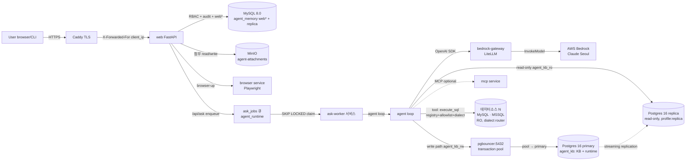

# Architecture — Data Flow

| 항목 | 값 |
|---|---|
| 분류 | `#wiki/article` |
| 정본 | [[../../docs/ARCHITECTURE\|docs/ARCHITECTURE.md]] + [[../../docs/SECURITY\|docs/SECURITY.md]] |
| diagram 유형 | mermaid flowchart + 컴포넌트 표 |

## 목차

1. [개요](#1-개요)
2. [상세](#2-상세)
     - [2.1 요청 처리 흐름](#21-요청-처리-흐름)
     - [2.2 신뢰 경계 (trust boundary)](#22-신뢰-경계-trust-boundary)
     - [2.3 audit 흐름 (ADR-0019)](#23-audit-흐름-adr-0019)
     - [2.4 Storage 이관 현황 (Phase 1 + Phase 2 완료, 2026-05-27)](#24-storage-이관-현황-phase-1--phase-2-완료-2026-05-27)
     - [2.5 멀티 데이터소스 data plane + ask-worker (2026-06)](#25-멀티-데이터소스-data-plane--ask-worker-2026-06)
3. [관련 문서](#3-관련-문서)
4. [둘러보기](#4-둘러보기)
5. [외부 link](#5-외부-link)
- [분류](#분류)

## 1. 개요

사용자 요청 → Caddy (TLS termination) → web (FastAPI) → agent loop (LLM tool-call) → MySQL replica + Postgres (KB + runtime) + MinIO storage 의 데이터 흐름을 정본 doc 의 §4 (기능 맵) + feature FUNCTION.md 의 *Main Flow* 섹션 mirror 로 시각화한다.

> **기능 단위 순서도는 [[../Flows/_Index|Flows/]] 에 있다.** 본 문서는 *컴포넌트 축* 의 한 장짜리 흐름이고, "로그인 한 번 / 질문 한 번 / 첨부 한 개가 어떤 관문을 어떤 순서로 지나는가" 는 아래 5 문서가 다룬다 — [[../Flows/Auth-and-Session|로그인·인증·세션]] · [[../Flows/External-AI-Bridge|외부 AI 연계 동작]] · [[../Flows/Security-Controls|보안 처리 과정]] · [[../Flows/User-Journeys|사용자 화면 흐름]] · [[../Flows/Feature-Operations|세부 기능 동작]].

> **2026-05-27 아키텍처 변경**: `agent_memory` DB 의 `agent*` 10 테이블 (runtime state) 이 Postgres `agent_runtime` schema 로 완전 이관. MySQL `agent_memory` 에는 `web*` 18 테이블만 잔존.
>
> **2026-06 멀티 데이터소스**: data plane 이 단일 MySQL replica → **N 개 데이터소스 (MySQL·MSSQL)** 로 일반화 (§2.5). 자격증명은 envelope 암호화 저장, 접근은 DB-단위 allowlist. agent 실행은 **ask-worker out-of-process 큐**로 cutover.
>
> **2026-08-27 외부 LLM 브리지 전환**: 서버 보유 계정으로 나가는 **chat** 호출이 fail-closed 로 전면 차단됐다(코드 게이트 + `litellm_config.yaml` 계정 alias 14종 주석, 그 시점의 활성 model_list = `titan-embed` 1건). 따라서 아래 §2.1 의 `agent → bedrock-gateway → AWS Bedrock` 경로와 §2.2 의 `agent → Bedrock` 신뢰 경계는 **임베딩 전용으로 축소**됐고, **2026-09-07 로컬 LLM 전면 폐기**로 그 `titan-embed` 마저 제거돼 지금은 활성 model_list 가 **0건**이다(`model_list: []`). 웹 대화 질문은 `_enqueue_web_bridge_task()` 가 `/api/ask` dispatch **앞에서** 가로채 `WebAiTasks` 대기 작업으로 적재하고, 사용자 개인 머신의 AI 가 MCP/REST(`list_open_requests` · `claim_request` · `submit_answer`)로 가져가 답변한다(pull 브리지). 정본: [[../Features/feature-0043-external-llm-bridge]]. **2026-08-31 확장**: 같은 대기열을 **관리 콘솔 작업**도 탄다 — 메타데이터 자동완성(단건·일괄)과 프롬프트 자동작성 3스코프가 `messages` 를 조립한 **뒤·LLM 호출 앞** 한 지점에서 위임되어 «대화가 없는 브리지 task»(`Kind` 축)로 적재되고, 개인 AI 가 같은 점유·lease·취소·원장 위에서 처리한다. 위임 대상이 아니면(게이트 열림 · 러너 자격 없음 · 미배선 종류 · 적재 실패) 종전 직접 경로가 그대로 돈다.

## 2. 상세

### 2.1 요청 처리 흐름



> `web` 의 in-process 실행 (`AGENT_ASK_EXECUTION_MODE=inprocess`) 도 롤백 옵션으로 잔존하나, 운영은 ask-worker 큐 (`=worker`) 가 라이브.
>
> **2026-08-26(feature-0043) 이후**: 위 그림의 `agent → bedrock-gateway → Bedrock Claude` 구간은 **대화 답변 경로에서 fail-closed 로 차단**됐다(`shared/llm_gate.py` 코드 기본값 = 차단 · `litellm_config.yaml` chat alias 14종 주석). 웹 대화 질문은 `/api/ask` 가 dispatch 앞에서 `WebAiTasks`(`Origin='web'`) 대기작업으로 분기하고, 각 사용자의 **개인 머신 AI 런타임**이 `/api/ai/mcp`(엣지 → `ext-tool-mcp-a/b` 2 replica LB, feature-0045)로 붙어 `wait_for_request`(블로킹 대기)→`claim_request`→`submit_answer` 로 처리한 답변이 원 대화에 실린다. **2026-09-07 로컬 LLM 전면 폐기**로 그 마지막 활성 경로였던 로컬 임베딩(`titan-embed` → `ollama/bge-m3`)까지 제거돼 게이트웨이의 활성 `model_name` 은 **0개**다(`model_list: []` — 컨테이너 자체 철거는 결정 축이 달라 이월). KB 검색은 `kb_retrieval` 의 2-tier 경로가 pg_trgm 문자 유사도로 흘러 끊기지 않는다(벡터 축만 강등). **2026-09-01 보강**: 그 개인 AI 가 받는 접지 지식은 MCP `get_task_context` 번들이 유일한 경로이며, 전환 직후 **클러스터 요약 1개 층**만 실려 관리 콘솔 큐레이션이 답변에 도달하지 않던 것을 용어사전 · ENUM 코드 · 테이블/컬럼 설명 · 샘플 쿼리 · 관계 **5층 추가**로 이었다(층별 fail-soft · 빠진 층은 이름을 밝혀 notes · 번들 상한과 절단 표기 · product 축은 그 task 의 `ProductId` 에서 해석). L0 통계 수집(`metadata_table_stats`·`metadata_column_stats`)은 LLM 게이트에 딸려 멈춰 있었으므로 게이트와 분리했다. **2026-09-02 정정 — 「유일한 경로」가 아니다.** 5층으로 넓힌 뒤에도 라이브 기여는 **0** 이었다. 서버는 옳았고(같은 시각 같은 제품에서 그 도구를 직접 부르면 정의가 나온다) **외부 AI 가 그 도구를 한 번도 부르지 않았다** — 러너가 안내하는 도구 목록에 조사 도구만 있었기 때문이다. 즉 전환이 바꾼 것은 위치가 아니라 **성격**(무조건 주입 → 「부르면 받음」)이었으므로 `claim_request` **응답에 `kb_context`·`kb_notes` 를 실어 자동 주입으로 되돌렸다**(러너가 근거를 질문보다 앞에 놓고 「이미 조회된 것이니 다시 조사하지 마라」를 덧붙인다 · 값이 없으면 블록 자체를 생략 · 매칭은 가드 래퍼가 붙지 않은 원문으로 한다). ⚠ 배치가 러너 `compose_prompt` 에 있어 **구버전 러너에는 안 실린다** — 서버가 `hb.stale_build` 로 갱신을 안내하는 것이 그 경로다.

### 2.2 신뢰 경계 (trust boundary)

| 경계 | 위치 | 검증 |
|---|---|---|
| 외부 → Caddy | Caddy 에서 TLS 종단 + `header_up X-Forwarded-For {client_ip}` 강제 | feature-0006 AC-0004 (ADR-0017 cascade) |
| Caddy → web | web 의 `_get_client_ip()` 가 `X-Forwarded-For` last hop 만 신뢰 | feature-0003 AC-0205~0207 |
| web → agent | `/api/ask` RBAC (`conversation.ask` / `console.manage` / `audit.*`) | ADR-0019 + feature-0003 audit hook |
| agent → Bedrock (2026-08-27 chat fail-closed 차단 → **2026-09-07 이후 활성 모델 0개** — 지나는 요청 없음) | `BEDROCK_GATEWAY_API_KEY` token 만 web/agent 가 인지, AWS credential 은 bedrock-gateway 컨테이너 env 만 | ADR-0026 + `.env.bedrock` 분리 · feature-0043 게이트 |
| agent → 데이터소스 (MySQL·MSSQL) | datasource registry 좌표(envelope 복호) + RO user, DB-단위 allowlist + 3축 SQL guard, fail-closed | [[../concepts/db-level-access]] · [[../concepts/datasource-registry]] |
| datasource host | SSRF: 메타데이터 IP 하드차단 + DNS rebinding pin (사설망 경계는 env 토글) | [[../Decisions/ADR-0030-ssrf-guard-toggle]] |
| sandbox schema | `attachment_writer` / `_reader` / `_maintainer` / `_cleanup` 4 user 분리 | ADR-0023 |
| 외부 AI 도구 → MCP 전송 | `ext-tool-mcp-a/b`(HTTP/SSE 2 replica · Caddy `ip_hash` LB · stateless, feature-0045)의 익명 스트림 차단을 Caddyfile `/api/ai/mcp` 라우트의 `Authorization` 존재 요구로 집행 — MCP 전송 계층에 verifier 가 없어 인가 경계 한 조각이 feature-0006 자산에 거주 | feature-0041 · feature-0006 ([[Overview]] §2.4 의존 행) |

### 2.3 audit 흐름 (ADR-0019)

| Step | 동작 |
|---|---|
| 1 | admin 11 / user 5 endpoint hook 이 `record_audit_event(conn, ...)` 호출 |
| 2 | `build_audit_change_json` ActionCode-specific builder allowlist 로 ChangeJson 조립 |
| 3 | admin = Same-tx fail-safe (`_audit_admin_mutation`) — INSERT 실패 = `conn.rollback()` + 500 |
| 4 | user = fail-open (`_audit_user_action`) — `/api/ask` 같은 long-running 실행은 audit 실패 격리 |
| 5 | KB mirror write 도 best-effort `_log_kb_write_audit()` 호출 (M2-c+) |

### 2.4 Storage 이관 현황 (Phase 1 + Phase 2 완료, 2026-05-27)

#### KB 이관 (Phase 1 — ADR-0021/0025, 완료)

```
M0 standalone → M1 schema → M2 dual-write (audit + pg_branch tag)
  → M3 backfill ETL + embedding worker → M4 cutover (read=Postgres)
  → M5 cleanup (MySQL drop, 14-day window) ✅ 완료 2026-05-27
```

`agent_kb` schema: `fact_entries`, `texts`, `rag_documents`, `rag_objects`, `agent_memory_facts` (VIEW).

#### agent runtime state 이관 (Phase 2 — ADR-0027/0028, 완료)

```
AR-M1 schema → AR-M2 dual-write → AR-M3 backfill
  → AR-M4 cutover (AGENT_RUNTIME_READ_BACKEND=postgres)
  → AR-M5 cleanup: 6 테이블 DROP ✅ → insight-worker PG primary write 전환
  → MySQL agent* 10 테이블 완전 제거 ✅ 완료 2026-05-27
```

`agent_runtime` schema: `core_conversations`, `core_messages`, `kv`, `messages`, `steps`, `summary`.

#### 현재 MySQL agent_memory 잔존 범위

`web*` 18 테이블 (RBAC catalog + audit + auth) — Phase 3 이관 대상.

자세히는 [[../Features/feature-0002-agent-core|feature-0002 카드]] + [[../Decisions/ADR-0021-kb-postgres-rbac|ADR-0021 mirror]] + [[../Decisions/ADR-0025-m5-cleanup|ADR-0025 mirror]].

### 2.5 멀티 데이터소스 data plane + ask-worker (2026-06)

| 흐름 | 동작 |
|---|---|
| datasource resolve | `cfg.get_datasource(key)` → `WebDatasources` (envelope 복호) 우선, `.env` `DS_<KEY>_*` fallback. resolve 시마다 복호 (평문 캐시 없음). |
| 호출 라우팅 | LLM 이 tool 로 datasource 선택 → `_DatasourceRouter` 가 호출 단위로 connection/allowlist/dialect 잠금 (`engine+datasource_key` pool key). |
| 접근 검증 | DB-단위 allowlist + 3축 보안 게이트 (AST allowlist · RO GRANT · sql_guard denylist). 시스템 DB = 가시성만. |
| insight 격리 | insight-worker 가 datasource scope (`engine+host+port` 해시) 로 `rag_objects` 격리 캐시 → 완료율/DB별 파악내용 표면화. |
| ask 실행 | `/api/ask` → `ask_jobs` enqueue → ask-worker `SKIP LOCKED` claim → agent loop. web 재배포가 in-flight run 죽이지 않음. |

흐름 상세: [[../concepts/multi-datasource]] · [[../concepts/db-level-access]] · [[../concepts/insight-worker]] · [[../concepts/ask-worker-queue]].

## 3. 관련 문서

- [[Architecture/Overview|Overview]] — 시스템 개요
- [[Architecture/Module-Map|Module-Map]] — 디렉토리 매핑
- [[../../docs/SECURITY|docs/SECURITY.md]] — trust boundary 정본
- [[../../docs/ARCHITECTURE|docs/ARCHITECTURE.md]] (정본)

## 4. 둘러보기

- 상위: [[Architecture/Overview|Overview]]
- 하위 (기능 단위 순서도): [[../Flows/_Index|Flows MOC]] — [[../Flows/Auth-and-Session]] · [[../Flows/External-AI-Bridge]] · [[../Flows/Security-Controls]] · [[../Flows/User-Journeys]] · [[../Flows/Feature-Operations]]
- sibling: [[Architecture/Module-Map|Module-Map]]
- 관련 feature: [[../Features/feature-0002-agent-core]] · [[../Features/feature-0003-agent-web-ui]] · [[../Features/feature-0007-bedrock-llm-provider]]

## 5. 외부 link

- 없음

## 분류

`#wiki/article` · `#confidence/high` · `#maturity/draft`
