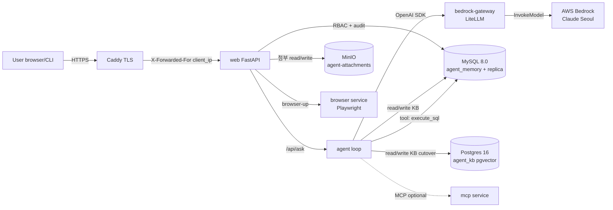

# Architecture — Data Flow

| 항목 | 값 |
|---|---|
| 분류 | `#wiki/article` |
| 정본 | [[../../docs/ARCHITECTURE\|docs/ARCHITECTURE.md]] + [[../../docs/SECURITY\|docs/SECURITY.md]] |
| diagram 유형 | mermaid flowchart + 컴포넌트 표 |

## 목차

1. [개요](#1-개요)
2. [상세](#2-상세)
   - 2.1 [요청 → 처리 → 저장](#21-요청--처리--저장)
   - 2.2 [경계 통과 지점](#22-경계-통과-지점)
   - 2.3 [비동기 / 동기](#23-비동기--동기)
3. [특징](#3-특징)
4. [비교 (선택)](#4-비교-선택)
   - 4.1 [동기 vs 비동기 처리](#41-동기-vs-비동기-처리-tbd)
5. [관련 문서](#5-관련-문서)
6. [외부 link](#6-외부-link)
7. [분류](#7-분류)

## 1. 개요

사용자 요청 → Caddy (TLS termination) → web (FastAPI) → agent loop (LLM tool-call) → MySQL replica + Postgres KB + MinIO storage 의 데이터 흐름을 정본 doc 의 §4 (기능 맵) + feature FUNCTION.md 의 *Main Flow* 섹션 mirror 로 시각화한다.

## 2. 상세

### 2.1 요청 처리 흐름



### 2.2 신뢰 경계 (trust boundary)

| 경계 | 위치 | 검증 |
|---|---|---|
| 외부 → Caddy | Caddy 에서 TLS 종단 + `header_up X-Forwarded-For {client_ip}` 강제 | feature-0006 AC-0004 (ADR-0017 cascade) |
| Caddy → web | web 의 `_get_client_ip()` 가 `X-Forwarded-For` last hop 만 신뢰 | feature-0003 AC-0205~0207 |
| web → agent | `/api/ask` RBAC (`conversation.ask` / `console.manage` / `audit.*`) | ADR-0019 + feature-0003 audit hook |
| agent → Bedrock | `BEDROCK_GATEWAY_API_KEY` token 만 web/agent 가 인지, AWS credential 은 bedrock-gateway 컨테이너 env 만 | ADR-0026 + `.env.bedrock` 분리 |
| agent → MySQL replica | `REPLICA_DB_*` env 의 read-only user — agent 가 데이터 plane 쓰기 안 함 | feature-0001 §14 |
| sandbox schema | `attachment_writer` / `_reader` / `_maintainer` / `_cleanup` 4 user 분리 | ADR-0023 |

### 2.3 audit 흐름 (ADR-0019)

| Step | 동작 |
|---|---|
| 1 | admin 11 / user 5 endpoint hook 이 `record_audit_event(conn, ...)` 호출 |
| 2 | `build_audit_change_json` ActionCode-specific builder allowlist 로 ChangeJson 조립 |
| 3 | admin = Same-tx fail-safe (`_audit_admin_mutation`) — INSERT 실패 = `conn.rollback()` + 500 |
| 4 | user = fail-open (`_audit_user_action`) — `/api/ask` 같은 long-running 실행은 audit 실패 격리 |
| 5 | KB mirror write 도 best-effort `_log_kb_write_audit()` 호출 (M2-c+) |

### 2.4 KB 마이그레이션 흐름 (TASK-0015, ADR-0021/0024/0025)

```
M0 standalone → M1 schema → M2 dual-write (audit + pg_branch tag)
  → M3 backfill ETL + embedding worker → M4 cutover (read=Postgres)
  → M5 cleanup (MySQL drop, 14-day window)
```

자세히는 [[../Features/feature-0002-agent-core|feature-0002 카드]] + [[../Decisions/ADR-0021-kb-postgres-rbac|ADR-0021 mirror]] + [[../Decisions/ADR-0025-m5-cleanup|ADR-0025 mirror]].

## 3. 관련 문서

- [[Overview]] — 시스템 개요
- [[Module-Map]] — 디렉토리 매핑
- [[../../docs/SECURITY|docs/SECURITY.md]] — trust boundary 정본
- [[../../docs/ARCHITECTURE|docs/ARCHITECTURE.md]] (정본)

## 4. 둘러보기

- 상위: [[Overview]]
- sibling: [[Module-Map]]
- 관련 feature: [[../Features/feature-0002-agent-core]] · [[../Features/feature-0003-agent-web-ui]] · [[../Features/feature-0007-bedrock-llm-provider]]

## 5. 외부 link

- 없음

## 분류

`#wiki/article` · `#confidence/high` · `#maturity/draft`
