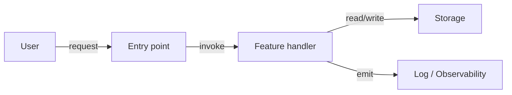

# Architecture — Data Flow

> 정본은 [[../../docs/ARCHITECTURE|docs/ARCHITECTURE.md]]. 본 노트는 데이터 흐름을 mermaid 또는 ascii 다이어그램으로 시각화한다.

## 1. 요청 → 처리 → 저장

> placeholder. 첫 feature 추가 또는 사용자의 명시 요청 시 AI 가 채운다.

## 2. 경계 통과 지점

- (TBD) 신뢰 경계 (외부 → 내부): 입력 검증 위치
- (TBD) 저장 경계: 영속화 시점

## 3. 관련 노트

- [[Overview]]
- [[Module-Map]]
- [[../../docs/SECURITY|Security]] — 신뢰 경계 정책
