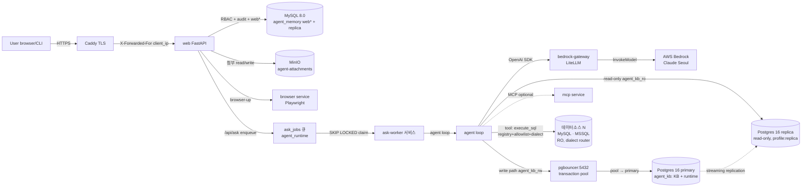

# Architecture — Data Flow

| 항목 | 값 |
|---|---|
| 분류 | `#wiki/article` |
| 정본 | [[../../docs/ARCHITECTURE\|docs/ARCHITECTURE.md]] + [[../../docs/SECURITY\|docs/SECURITY.md]] |
| diagram 유형 | mermaid flowchart + 컴포넌트 표 |

## 목차

1. [개요](#1-개요)
2. [상세](#2-상세)
     - [2.1 요청 처리 흐름](#21-요청-처리-흐름)
     - [2.2 신뢰 경계 (trust boundary)](#22-신뢰-경계-trust-boundary)
     - [2.3 audit 흐름 (ADR-0019)](#23-audit-흐름-adr-0019)
     - [2.4 KB 마이그레이션 흐름 (TASK-0015, ADR-0021/0024/0025)](#24-kb-마이그레이션-흐름-task-0015-adr-002100240025)
3. [관련 문서](#3-관련-문서)
4. [둘러보기](#4-둘러보기)
5. [외부 link](#5-외부-link)
- [분류](#분류)

## 1. 개요

사용자 요청 → Caddy (TLS termination) → web (FastAPI) → agent loop (LLM tool-call) → MySQL replica + Postgres (KB + runtime) + MinIO storage 의 데이터 흐름을 정본 doc 의 §4 (기능 맵) + feature FUNCTION.md 의 *Main Flow* 섹션 mirror 로 시각화한다.

> **2026-05-27 아키텍처 변경**: `agent_memory` DB 의 `agent*` 10 테이블 (runtime state) 이 Postgres `agent_runtime` schema 로 완전 이관. MySQL `agent_memory` 에는 `web*` 18 테이블만 잔존.
>
> **2026-06 멀티 데이터소스**: data plane 이 단일 MySQL replica → **N 개 데이터소스 (MySQL·MSSQL)** 로 일반화 (§2.5). 자격증명은 envelope 암호화 저장, 접근은 DB-단위 allowlist. agent 실행은 **ask-worker out-of-process 큐**로 cutover.

## 2. 상세

### 2.1 요청 처리 흐름



> `web` 의 in-process 실행 (`AGENT_ASK_EXECUTION_MODE=inprocess`) 도 롤백 옵션으로 잔존하나, 운영은 ask-worker 큐 (`=worker`) 가 라이브.

### 2.2 신뢰 경계 (trust boundary)

| 경계 | 위치 | 검증 |
|---|---|---|
| 외부 → Caddy | Caddy 에서 TLS 종단 + `header_up X-Forwarded-For {client_ip}` 강제 | feature-0006 AC-0004 (ADR-0017 cascade) |
| Caddy → web | web 의 `_get_client_ip()` 가 `X-Forwarded-For` last hop 만 신뢰 | feature-0003 AC-0205~0207 |
| web → agent | `/api/ask` RBAC (`conversation.ask` / `console.manage` / `audit.*`) | ADR-0019 + feature-0003 audit hook |
| agent → Bedrock | `BEDROCK_GATEWAY_API_KEY` token 만 web/agent 가 인지, AWS credential 은 bedrock-gateway 컨테이너 env 만 | ADR-0026 + `.env.bedrock` 분리 |
| agent → 데이터소스 (MySQL·MSSQL) | datasource registry 좌표(envelope 복호) + RO user, DB-단위 allowlist + 3축 SQL guard, fail-closed | [[../concepts/db-level-access]] · [[../concepts/datasource-registry]] |
| datasource host | SSRF: 메타데이터 IP 하드차단 + DNS rebinding pin (사설망 경계는 env 토글) | [[../Decisions/ADR-0030-ssrf-guard-toggle]] |
| sandbox schema | `attachment_writer` / `_reader` / `_maintainer` / `_cleanup` 4 user 분리 | ADR-0023 |

### 2.3 audit 흐름 (ADR-0019)

| Step | 동작 |
|---|---|
| 1 | admin 11 / user 5 endpoint hook 이 `record_audit_event(conn, ...)` 호출 |
| 2 | `build_audit_change_json` ActionCode-specific builder allowlist 로 ChangeJson 조립 |
| 3 | admin = Same-tx fail-safe (`_audit_admin_mutation`) — INSERT 실패 = `conn.rollback()` + 500 |
| 4 | user = fail-open (`_audit_user_action`) — `/api/ask` 같은 long-running 실행은 audit 실패 격리 |
| 5 | KB mirror write 도 best-effort `_log_kb_write_audit()` 호출 (M2-c+) |

### 2.4 Storage 이관 현황 (Phase 1 + Phase 2 완료, 2026-05-27)

#### KB 이관 (Phase 1 — ADR-0021/0025, 완료)

```
M0 standalone → M1 schema → M2 dual-write (audit + pg_branch tag)
  → M3 backfill ETL + embedding worker → M4 cutover (read=Postgres)
  → M5 cleanup (MySQL drop, 14-day window) ✅ 완료 2026-05-27
```

`agent_kb` schema: `fact_entries`, `texts`, `rag_documents`, `rag_objects`, `agent_memory_facts` (VIEW).

#### agent runtime state 이관 (Phase 2 — ADR-0027/0028, 완료)

```
AR-M1 schema → AR-M2 dual-write → AR-M3 backfill
  → AR-M4 cutover (AGENT_RUNTIME_READ_BACKEND=postgres)
  → AR-M5 cleanup: 6 테이블 DROP ✅ → insight-worker PG primary write 전환
  → MySQL agent* 10 테이블 완전 제거 ✅ 완료 2026-05-27
```

`agent_runtime` schema: `core_conversations`, `core_messages`, `kv`, `messages`, `steps`, `summary`.

#### 현재 MySQL agent_memory 잔존 범위

`web*` 18 테이블 (RBAC catalog + audit + auth) — Phase 3 이관 대상.

자세히는 [[../Features/feature-0002-agent-core|feature-0002 카드]] + [[../Decisions/ADR-0021-kb-postgres-rbac|ADR-0021 mirror]] + [[../Decisions/ADR-0025-m5-cleanup|ADR-0025 mirror]].

### 2.5 멀티 데이터소스 data plane + ask-worker (2026-06)

| 흐름 | 동작 |
|---|---|
| datasource resolve | `cfg.get_datasource(key)` → `WebDatasources` (envelope 복호) 우선, `.env` `DS_<KEY>_*` fallback. resolve 시마다 복호 (평문 캐시 없음). |
| 호출 라우팅 | LLM 이 tool 로 datasource 선택 → `_DatasourceRouter` 가 호출 단위로 connection/allowlist/dialect 잠금 (`engine+datasource_key` pool key). |
| 접근 검증 | DB-단위 allowlist + 3축 보안 게이트 (AST allowlist · RO GRANT · sql_guard denylist). 시스템 DB = 가시성만. |
| insight 격리 | insight-worker 가 datasource scope (`engine+host+port` 해시) 로 `rag_objects` 격리 캐시 → 완료율/DB별 파악내용 표면화. |
| ask 실행 | `/api/ask` → `ask_jobs` enqueue → ask-worker `SKIP LOCKED` claim → agent loop. web 재배포가 in-flight run 죽이지 않음. |

흐름 상세: [[../concepts/multi-datasource]] · [[../concepts/db-level-access]] · [[../concepts/insight-worker]] · [[../concepts/ask-worker-queue]].

## 3. 관련 문서

- [[Architecture/Overview|Overview]] — 시스템 개요
- [[Architecture/Module-Map|Module-Map]] — 디렉토리 매핑
- [[../../docs/SECURITY|docs/SECURITY.md]] — trust boundary 정본
- [[../../docs/ARCHITECTURE|docs/ARCHITECTURE.md]] (정본)

## 4. 둘러보기

- 상위: [[Architecture/Overview|Overview]]
- sibling: [[Architecture/Module-Map|Module-Map]]
- 관련 feature: [[../Features/feature-0002-agent-core]] · [[../Features/feature-0003-agent-web-ui]] · [[../Features/feature-0007-bedrock-llm-provider]]

## 5. 외부 link

- 없음

## 분류

`#wiki/article` · `#confidence/high` · `#maturity/draft`
