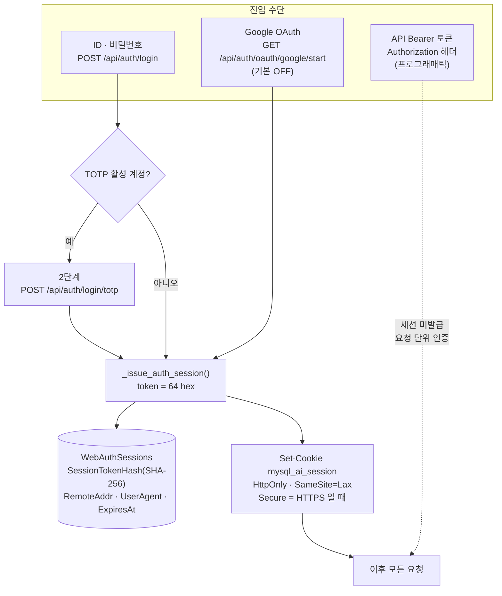
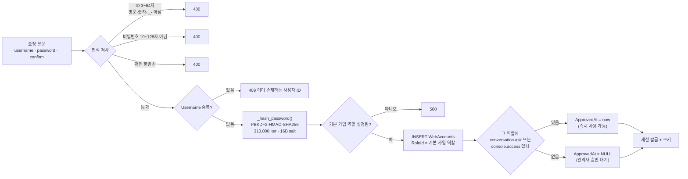
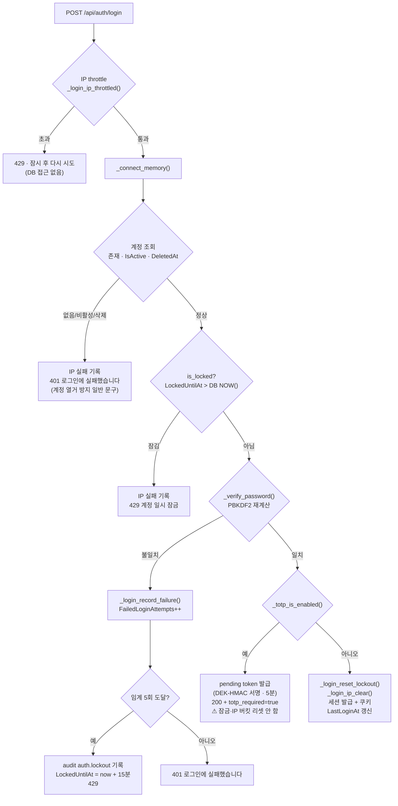
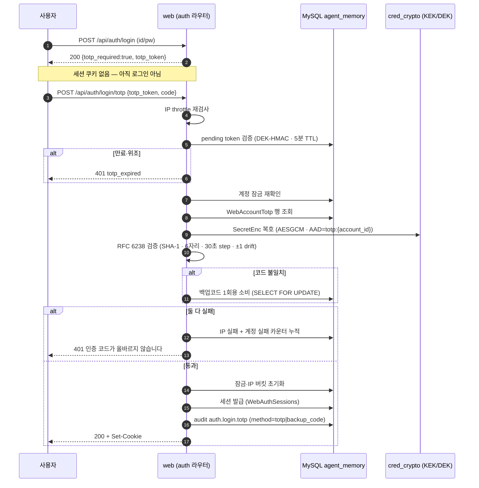
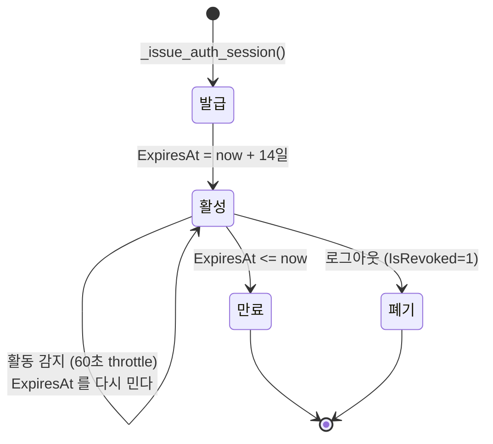
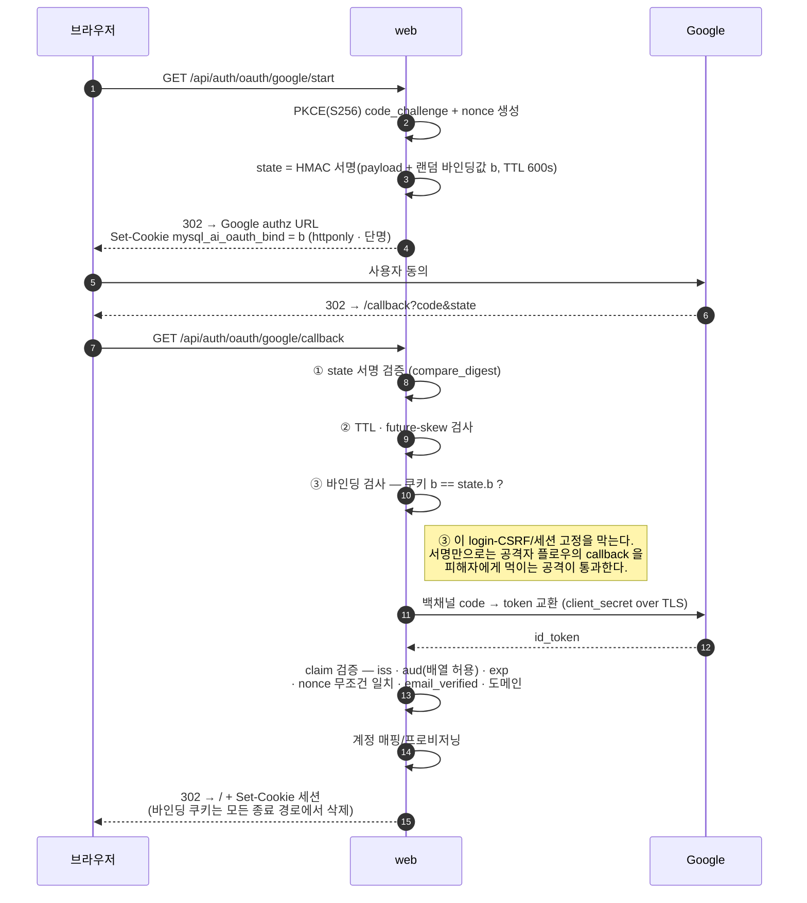
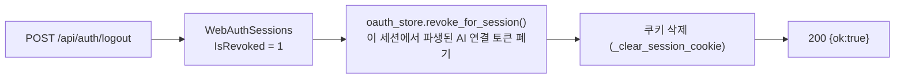

# Flows — 로그인·인증·세션

| 항목 | 값 |
|---|---|
| 분류 | `#wiki/article` |
| 정본 | [[../../docs/SECURITY\|docs/SECURITY.md]] §12·§13·§15·§16 · `unit/feature-0003-agent-web-ui/docs/FUNCTION.md` AC-0588~0607 |
| 코드 | `unit/feature-0003-agent-web-ui/src/routers/auth.py` (18 route) · `src/web_context.py` (세션·해시 클러스터) · `src/app.py` (DI seam) |
| 저장 | MySQL `agent_memory` — `WebAccounts` · `WebAuthSessions` · `WebRoles` · `WebAuditEvents` |
| 인증 수단 | 로컬 ID/비밀번호 (기본) · TOTP 2단계 (opt-in) · Google OAuth (기본 OFF) · API Bearer 토큰 (프로그래매틱) |

## 목차

1. [개요](#1-개요)
2. [상세](#2-상세)
     - [2.1 전체 인증 지형](#21-전체-인증-지형)
     - [2.2 회원가입](#22-회원가입)
     - [2.3 로그인 — 1단계 (비밀번호)](#23-로그인--1단계-비밀번호)
     - [2.4 로그인 — 2단계 (TOTP·백업코드)](#24-로그인--2단계-totp백업코드)
     - [2.5 무차별 대입 방어 2중 bound](#25-무차별-대입-방어-2중-bound)
     - [2.6 세션 수명과 슬라이딩 만료](#26-세션-수명과-슬라이딩-만료)
     - [2.7 매 요청의 인증·권한 판정 (DI seam)](#27-매-요청의-인증권한-판정-di-seam)
     - [2.8 Google OAuth (기본 비활성)](#28-google-oauth-기본-비활성)
     - [2.9 API 토큰 fallback](#29-api-토큰-fallback)
     - [2.10 로그아웃 — 세션과 AI 연결을 함께 죽인다](#210-로그아웃--세션과-ai-연결을-함께-죽인다)
3. [특징](#3-특징)
4. [평가](#4-평가)
5. [관련 문서](#5-관련-문서)
6. [둘러보기](#6-둘러보기)
7. [외부 link](#7-외부-link)
- [분류](#분류)

## 1. 개요

이 서비스의 인증은 **세션 쿠키 1개**로 수렴한다. 어떤 경로로 로그인하든(로컬 비밀번호 · TOTP 2단계 · Google OAuth) 마지막은 같은 `_issue_auth_session()` 이며, 발급된 토큰은 **평문으로 저장되지 않는다** — DB 에는 해시만 남고 원본은 `HttpOnly` 쿠키에만 존재한다. 권한은 로그인 시점이 아니라 **매 요청마다** 계정의 역할에서 다시 해석되므로, 관리자가 역할을 바꾸면 재로그인 없이 즉시 반영된다.

## 2. 상세

### 2.1 전체 인증 지형



세 진입 수단 중 **세션을 만드는 것은 앞의 둘뿐**이다. API 토큰은 세션을 만들지 않고 요청마다 계정으로 해석되며, 쿠키가 유효하면 애초에 토큰 경로를 타지 않는다(사람 세션 무회귀).

### 2.2 회원가입

`POST /api/auth/signup` — 가입은 되지만 **바로 쓸 수 있다는 뜻은 아니다**. 기본 가입 역할에 `conversation.ask` 또는 `console.access` 가 없으면 `ApprovedAt` 이 NULL 로 남아 승인 대기 상태가 된다.



비밀번호 저장 형식은 `pbkdf2_sha256$<iterations>$<salt_b64>$<digest_b64>` 이며, 반복 횟수를 문자열에 함께 적어 **나중에 iteration 을 올려도 옛 해시를 계속 검증**할 수 있다. 검증은 `hmac.compare_digest` 로 상수시간 비교한다.

### 2.3 로그인 — 1단계 (비밀번호)

가장 밀도 높은 경로다. 순서 자체가 방어의 일부여서, **DB 를 두드리기 전에 IP 를 먼저 본다.**



두 가지가 의도적이다.

- **잠긴 계정의 판정은 DB 시계**(`LockedUntilAt > NOW()`)로 한다 — 웹 컨테이너와 DB 의 시계가 어긋나도 잠금 길이가 흔들리지 않는다.
- **2FA 분기에서는 잠금·IP 버킷을 리셋하지 않는다.** 비밀번호만 통과시켜 리셋하면, 비밀번호를 이미 아는 공격자가 1단계를 반복하며 throttle 을 무한 리셋하고 6자리 코드를 무차별 대입할 수 있다. 리셋은 **2단계 완료 시에만**.

### 2.4 로그인 — 2단계 (TOTP·백업코드)



TOTP secret 은 **평문으로 저장되지 않는다** — `cred_crypto` 가 DEK 를 KEK 로 wrap 한 AESGCM 봉투에 넣고, AAD 로 `totp:{account_id}` 를 묶어 다른 계정의 봉투를 갖다 붙이는 것을 막는다. 평문은 setup 응답에 **1회만** 노출된다. KEK 가 없으면 setup 은 503 이고, 이미 `Enabled=1` 인 계정은 fail-closed(로그인 2단계 통과 불가) — 복구는 관리자 강제 해제뿐이다.

### 2.5 무차별 대입 방어 2중 bound

| 축 | 저장 위치 | 기본값 | 범위 | 리셋 시점 |
|---|---|---|---|---|
| 계정 잠금 | `WebAccounts.FailedLoginAttempts` / `LockedUntilAt` (DB) | 연속 5회 → 15분 | **cross-worker · cross-IP** | 로그인 성공 · 관리자 해제 · 비밀번호 초기화 |
| IP throttle | web 프로세스 in-memory token bucket | 600초 내 20회 | 워커 1개 | 로그인 성공 시 해당 IP 버킷 clear |

두 축이 서로의 구멍을 덮는다. 계정 잠금은 여러 IP 에서 한 계정을 때리는 공격을, IP throttle 은 한 IP 에서 여러 계정을 훑는 공격을 잡는다. **관리자 해제**는 `POST /api/admin/accounts/{id}/unlock` — 비밀번호를 바꾸지 않고 잠금만 푼다(표적 DoS 회복용).

정직한 한계는 정본에 그대로 적혀 있다: `is_locked` 는 느린 PBKDF2 직전의 스냅샷이라 **동시 요청 버스트는 임계를 넘길 수 있다**(연속 한도이지 절대 상한이 아니다). 분산 botnet 은 사내 LAN 위협모델 밖이다. → [[../../docs/SECURITY|docs/SECURITY.md]] §12.2

### 2.6 세션 수명과 슬라이딩 만료



활동이 있으면 만료를 미는데, 그 계산이 세 겹으로 방어돼 있다.

```sql
ExpiresAt = GREATEST(
    ExpiresAt,                                  -- 이미 더 먼 만료를 앞당기지 않는다
    LEAST(CreatedAt + 90일,                     -- 슬라이딩에 절대 상한
          UTC_TIMESTAMP() + 14일)
)
```

- `GREATEST` — 없으면 "쓸수록 세션이 짧아지는" 역전이 난다.
- `LEAST(...)` — 슬라이딩이 영원히 갱신되지 않도록 발급일 기준 상한을 씌운다.
- `UTC_TIMESTAMP()` (`NOW()` 아님) — `ExpiresAt` 은 파이썬이 UTC 로 넣은 값이고 컨테이너 TZ 는 `Asia/Seoul` 이라, `NOW()` 로 밀면 9시간을 덤으로 준다(라이브 실측 2026-08-28).
- 갱신 자체는 **60초 throttle** 뒤에 있다 — 폴링 트래픽이 매 요청 UPDATE 를 때리지 않는다.

### 2.7 매 요청의 인증·권한 판정 (DI seam)

라우터 핸들러는 인증을 직접 하지 않는다. FastAPI 의존성 3종이 그 일을 맡고, 이 셋이 곧 인가 경계의 정본이다.

```mermaid
flowchart TD
    REQ["요청"] --> GC["get_conn()<br/>MySQL 연결 (fail-soft: 실패 시 None yield)"]
    GC --> BR{"핸들러가 요구하는 의존성"}

    BR -->|require_permission&#40;'a','b'&#41;| RP["get_current_account 선행"]
    BR -->|get_current_account| CA["세션 해석"]
    BR -->|get_optional_account| OA["세션 해석 (실패해도 raise 안 함)"]

    RP --> CA
    CA --> S1{"conn is None?"}
    S1 -->|예| E500["500 db connection failed"]
    S1 -->|아니오| S2["_get_authenticated_account()<br/>쿠키 해시 → WebAuthSessions 조인<br/>IsRevoked=0 · ExpiresAt>now<br/>· IsActive=1 · DeletedAt IS NULL"]
    S2 --> S3{"계정 있음?"}
    S3 -->|아니오| TK{"Bearer API 토큰?"}
    TK -->|유효| ACC
    TK -->|없음| E401["401 로그인이 필요합니다"]
    S3 -->|예| ACC["account dict<br/>(permissions 포함)"]
    ACC --> PG{"권한 AND 게이트"}
    PG -->|하나라도 없음| E403["403 권한이 없습니다"]
    PG -->|전부 있음| H["핸들러 실행"]

    OA --> ON{"실패?"}
    ON -->|예| NONE["None → 익명으로 계속<br/>(cheap-read 200 fail-soft)"]
    ON -->|아니오| H
```



- `require_permission(*perms)` 는 **AND 게이트**다. OR 조건이나 동적 권한 코드는 이 팩토리로 표현하지 않고, `get_current_account` 만 걸고 핸들러 본문에서 검사한다.
- 무인자 호출(`require_permission()`)은 "인증만 통과시키는" footgun 이라 **import 시점에 `ValueError`** 로 막는다.
- 권한 집합은 세션이 아니라 **계정의 역할에서 매 요청 해석**된다 — 역할 변경이 즉시 반영되는 이유다.
- 현재 라우트별 권한 표는 [[../../docs/ROUTEMAP|docs/ROUTEMAP.md]] 가 정본이며 `python3 bin/gen-routemap.py` 로 재생성된다.

### 2.8 Google OAuth (기본 비활성)

`WEB_OAUTH_GOOGLE_ENABLED` · `CLIENT_ID` · `CLIENT_SECRET` · `REDIRECT_URI` 가 **모두** 채워졌을 때만 활성이고, 하나라도 비면 `/start`·`/callback` 이 **404** 다. 로그인 화면의 Google 버튼은 `GET /api/auth/oauth/config` 가 돌려주는 bool 하나로 노출을 결정한다(민감값 0).



OAuth 로 만들어진 계정의 `PasswordHash` 는 **비-pbkdf2 sentinel** 이라 `_verify_password` 가 항상 False — 비밀번호 로그인이 원천 차단된다. 알려진 미보완(활성화 전 필수)은 **ID token 의 JWKS RS256 서명 미검증**과 **도메인 화이트리스트 공란**이다 → [[../../docs/SECURITY|docs/SECURITY.md]] §15.3·§15.4.

### 2.9 API 토큰 fallback

쿠키가 없거나 무효일 때만 `Authorization: Bearer` 로 계정을 해석한다(feature-0023). 세션 경로가 먼저 반환되므로 사람 세션에는 영향이 없다. 토큰에는 **scope** 가 붙어 있어, scope 밖 엔드포인트는 계정 권한이 충분해도 거부된다 — 관리자 계정의 토큰으로 관리 API 를 호출해도 403 이 나는 것은 이 때문이다.

### 2.10 로그아웃 — 세션과 AI 연결을 함께 죽인다



종전에는 세션만 revoke 했다. 인증은 막혔지만 **토큰 행은 살아 있는 것처럼 남아**(`RevokedAt IS NULL`) "연결된 AI 가 있는가" 를 세는 화면이 죽은 연결을 살아 있다고 말했고, 사용자는 로그아웃 뒤에도 "연결됨" 안내를 받았다. 토큰 전파 실패는 로그아웃 자체를 실패시키지 않는다(인증은 이미 막혔다) — 화면 표시만 한동안 낙관적일 수 있다. 자세히는 [[External-AI-Bridge|외부 AI 연계 동작]] 참조.

## 3. 특징

- **단일 세션 수렴** — 진입 수단이 셋이어도 세션 발급 지점은 하나(`_issue_auth_session`)라, 세션 정책을 한 곳에서 바꾼다.
- **토큰 평문 미보관** — DB 는 SHA-256 해시만 안다. DB 유출로 남의 세션을 위조할 수 없다.
- **매 요청 권한 재해석** — 역할 변경이 즉시 반영되고, 세션에 권한을 굳히지 않는다.
- **fail-soft 와 fail-closed 의 의도적 비대칭** — 필수 인증은 실패 시 401/500 으로 끊고, 익명 허용 경로(`get_optional_account`)는 절대 raise 하지 않는다.
- **정직한 한계 기록** — 계정 열거 오라클, 동시요청 soft-threshold, JWKS 미검증이 전부 정본에 명시돼 있다.

## 4. 평가

| 축 | 상태 |
|---|---|
| 강점 | 2중 bound brute-force 방어 · 상수시간 비교 · 슬라이딩 만료의 3중 가드 · OAuth 3중 state 방어(서명·TTL·브라우저 바인딩) |
| 위험 | IP throttle 이 워커 로컬(멀티워커 시 워커당 적용) · 잠금 메시지가 계정 존재를 누설 · OAuth 활성화 시 JWKS 서명 검증 선행 필요 |
| 전제 | 사내 LAN dev/staging 위협모델. 외부 공개 노출 시 §12.2·§15.3 의 보완 항목이 선행 조건 |

## 5. 관련 문서

- [[Security-Controls|보안 처리 과정]] — 인증 이후의 인가·데이터 경계
- [[User-Journeys|사용자 화면 흐름]] — 로그인 화면과 프로필 패널의 실제 조작
- [[External-AI-Bridge|외부 AI 연계 동작]] — 세션에 결속된 AI 연결 토큰
- [[../../docs/SECURITY|docs/SECURITY.md]] — 위협모델·한계의 정본

## 6. 둘러보기

- 상위: [[_Index|Flows MOC]]
- sibling: [[External-AI-Bridge]] · [[Security-Controls]] · [[User-Journeys]] · [[Feature-Operations]]
- 관련 feature: [[../Features/feature-0003-agent-web-ui]] · [[../Features/feature-0023-conversation-api-access]] · [[../Features/feature-0010-google-drive-integration]]

## 7. 외부 link

- [RFC 6238 — TOTP](https://datatracker.ietf.org/doc/html/rfc6238)
- [OpenID Connect Core §3.1.3.7 — ID Token 검증](https://openid.net/specs/openid-connect-core-1_0.html#IDTokenValidation)

## 분류

`#wiki/article` · `#status/active` · `#confidence/high` · `#maturity/substantial`
