# Flows — 외부 AI(개인 머신) 연계 동작

| 항목 | 값 |
|---|---|
| 분류 | `#wiki/article` |
| 정본 | `unit/feature-0043-external-llm-bridge/docs/FUNCTION.md` · `unit/feature-0041-external-ai-tool-surface/docs/FUNCTION.md` · `unit/feature-0045-zd-bridge-continuity/docs/FUNCTION.md` |
| 코드 | `shared/llm_gate.py` · `shared/bridge_tasks.py` · `src/routers/ai_tools.py` (13 route) · `src/routers/oauth_as.py` (13 route) · `src/routers/ai_discovery.py` (7 route) |
| 저장 | MySQL `WebAiTasks` (대기 작업 원장) · `WebAiToolLedger` (도구 사용 원장) · OAuth 토큰 store |
| 전환 시점 | 2026-08-26 — 서버 보유 계정의 **chat** LLM 호출 fail-closed 전면 차단 |

## 목차

1. [개요](#1-개요)
2. [상세](#2-상세)
     - [2.1 왜 방향이 뒤집혔나](#21-왜-방향이-뒤집혔나)
     - [2.2 게이트 — 서버 LLM 차단의 실제 지점](#22-게이트--서버-llm-차단의-실제-지점)
     - [2.3 대화 질문 1건의 전체 왕복](#23-대화-질문-1건의-전체-왕복)
     - [2.4 연결 — 사람의 몫은 복사 3번](#24-연결--사람의-몫은-복사-3번)
     - [2.5 즉시 인지 — 폴링 없는 블로킹 대기](#25-즉시-인지--폴링-없는-블로킹-대기)
     - [2.6 러너끼리 다툴 때 — 연결 순서 축](#26-러너끼리-다툴-때--연결-순서-축)
     - [2.7 접지 지식 — get_task_context 5층](#27-접지-지식--get_task_context-5층)
     - [2.8 도구 호출 1건이 지나는 6관문](#28-도구-호출-1건이-지나는-6관문)
     - [2.9 관리 콘솔·배치 작업 위임 (Kind 축)](#29-관리-콘솔배치-작업-위임-kind-축)
     - [2.10 상태 기계 — task 의 일생](#210-상태-기계--task-의-일생)
     - [2.11 배포가 왕복을 끊지 않는다 (feature-0045)](#211-배포가-왕복을-끊지-않는다-feature-0045)
3. [특징](#3-특징)
4. [비교](#4-비교)
5. [평가](#5-평가)
6. [관련 문서](#6-관련-문서)
7. [둘러보기](#7-둘러보기)
8. [외부 link](#8-외부-link)
- [분류](#분류)

## 1. 개요

2026-08-26 이후 이 서비스는 **스스로 추론하지 않는다**. 서버가 보유한 Claude 계정으로 나가는 chat 호출은 fail-closed 게이트로 막혀 있고, 사용자의 질문은 `WebAiTasks` 라는 **대기 작업**으로 적재된다. 그 질문을 가져가 답하는 것은 **그 사용자 본인 컴퓨터의 AI 런타임**(Claude Code 등)이며, 서버는 도구·컨텍스트·데이터만 제공한다. 서비스는 어떤 사용자 LLM 자격증명도 보관하지 않고, 대화 기록은 서비스 측에 남는다.

이 구조를 MCP `sampling`(서버 → 클라이언트 push)이 아니라 **도구 기반 pull** 로 구현한 이유는 sampling 이 프로토콜 `2026-07-28` 에서 폐기됐고(SEP-2577) Claude Code 가 미지원이기 때문이다.

## 2. 상세

### 2.1 왜 방향이 뒤집혔나

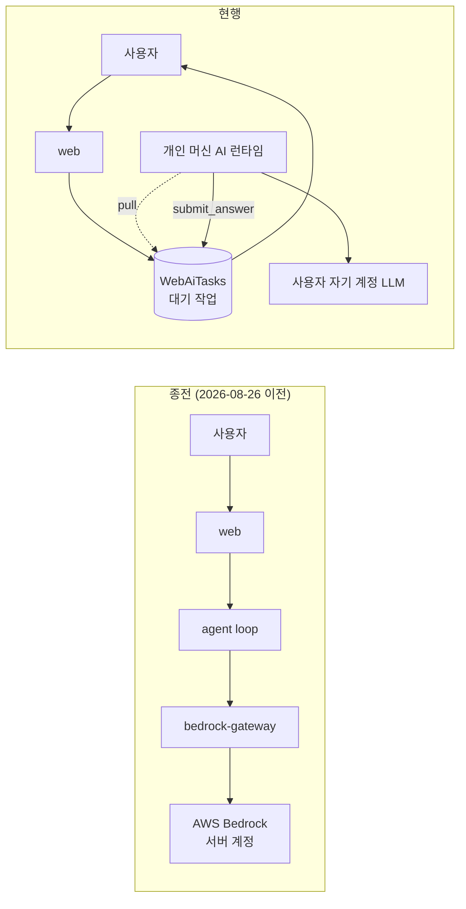

전환의 귀결 세 가지가 설계 전체를 지배한다.

1. **LLM 비용이 호출자에게 귀속된다** — 서버 계정 쿼터 소진이 이 표면을 멈추지 않는다.
2. **추론 루프가 우리 프로세스 밖에 있다** — 그래서 `agent_core` 가 답변마다 하던 일(발신자 각인·회수 store 기록·첨부 인지·실행 단계 원장)을 브리지가 **"그냥 안 하는"** 구멍이 생기고, 그건 계산이 아니라 **연결**이 끊긴 형태라 헬퍼 단위 테스트로는 전부 통과한다. 그 구멍들을 하나씩 메운 것이 feature-0043 의 P0-E~P0-AA 항목이다.
3. **연결이 없으면 답이 오지 않는다** — 그래서 "연결됨" 판정이 화면·저장 본문·응답·토스트에서 **같은 한 번의 판정**을 써야 한다.

### 2.2 게이트 — 서버 LLM 차단의 실제 지점

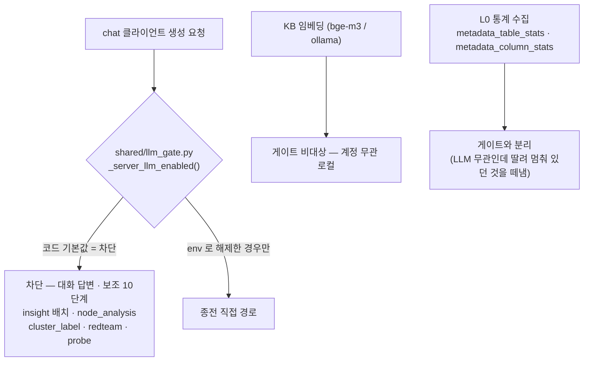

- 차단은 **코드 기본값**이다 — 설정 파일이 배포되지 않은 환경에서도 차단이 유효하도록 안전측에 둔다.
- 집행 지점은 chat 클라이언트 생성 chokepoint 2곳(`modules/llm._get_llm_client`, `agent_core` 의 직접 `OpenAI(...)` 생성)이며, `litellm_config.yaml` 의 계정 alias 14종은 주석 처리돼 활성 `model_list` 가 `titan-embed` 1건뿐이다.
- 따라서 [[../Architecture/Data-Flow|Data-Flow]] 의 `agent → bedrock-gateway → Bedrock` 구간은 **임베딩 전용으로 축소**됐다.

### 2.3 대화 질문 1건의 전체 왕복

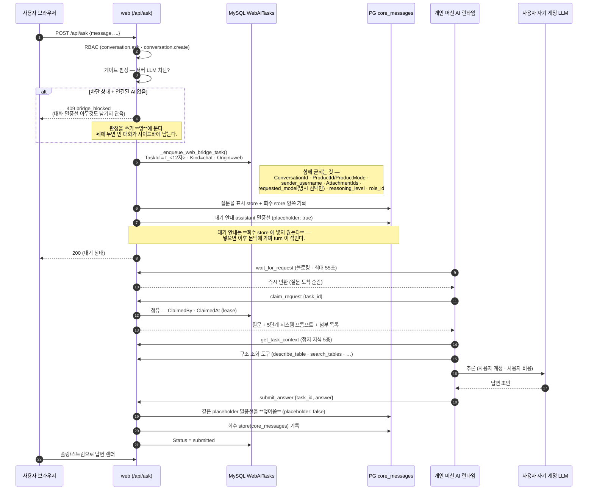

placeholder 덮어쓰기 범위는 **3겹으로 좁혀져 있다** — 같은 대화 · `role='assistant'` · **이 task 의** placeholder. 넓으면 남의 말풍선을 덮는다. 안내를 못 찾으면(구 task) 새 말풍선으로 append 하는 폴백이 돈다.

### 2.4 연결 — 사람의 몫은 복사 3번

사용자에게 "당신의 AI 가 MCP 를 지원하는가" 를 묻지 않는다. 그건 만든 사람이나 답할 수 있는 질문이다.

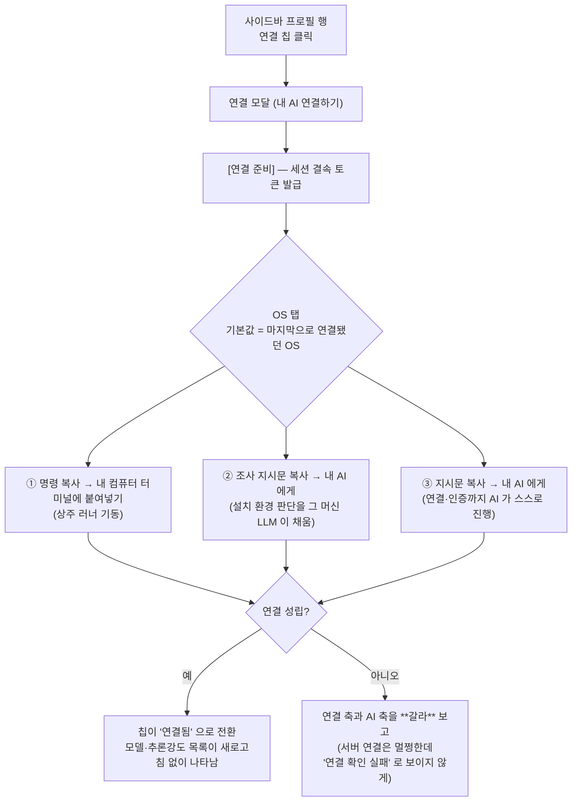

지시문의 방법 순서는 "간단해 보이는 순" 이 아니라 **사람을 다시 부르지 않는 순**이다.

| 순서 | 방법 | 사람 개입 |
|---|---|---|
| A | MCP 설정에 URL + `Authorization: Bearer` 헤더 | 없음 |
| B | HTTP 직접 호출 | 없음 |
| C | 커넥터 주소만 등록 (표준 OAuth) | 브라우저 '허용' 1회 → **뒤로** |

커넥터 OAuth 가 가장 간단해 보이지만 사람을 다시 부른다. "복사만 하면 끝" 을 지키려면 토큰이 이미 손에 있는 경로가 먼저여야 한다. 토큰은 **세션 결속**이라 로그아웃 시 즉시 무효다([[Auth-and-Session#210-로그아웃--세션과-ai-연결을-함께-죽인다|§2.10]]).

### 2.5 즉시 인지 — 폴링 없는 블로킹 대기

MCP 는 클라이언트 → 서버 단방향이라 서버가 AI 를 깨울 수 없다. 그렇다고 N 초마다 목록을 조회하면 질문이 최대 N 초 늦게 인지되고, **그 N 이 사람마다 달라 환경 차이가 된다.**

| | 주기 폴링 | `wait_for_request` (채택) |
|---|---|---|
| 호출 | N초마다 | **한 번** |
| 인지 시점 | 최대 N초 지연 | **즉시** |
| 간격 | 클라이언트마다 다름 | **서버 고정** (55초 상한) |

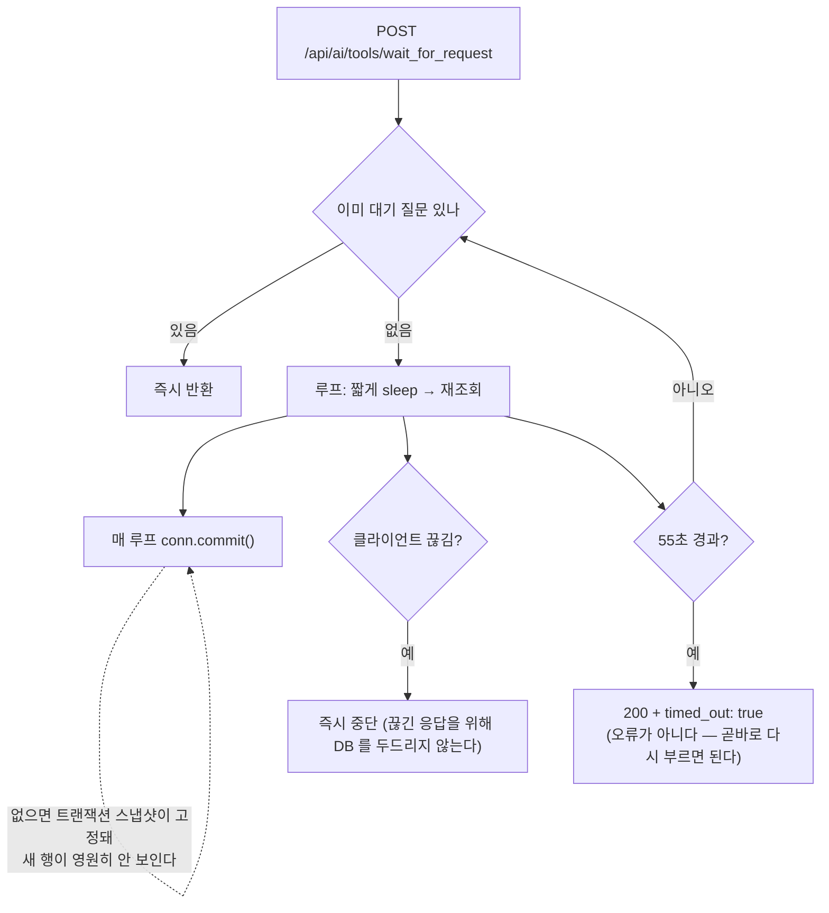

`timed_out` 이 **200 인 것이 계약이다** — 오류로 만들면 클라이언트가 backoff 를 넣고, 그 backoff 가 곧 폴링 간격이 되어 없애려던 환경 차이가 돌아온다.

### 2.6 러너끼리 다툴 때 — 연결 순서 축

한 계정에 여러 러너가 붙을 수 있다(다른 컴퓨터, 재설치 후 잔존 프로세스 등). 누가 처리하는가의 판정 축은 **연결 순서**다.

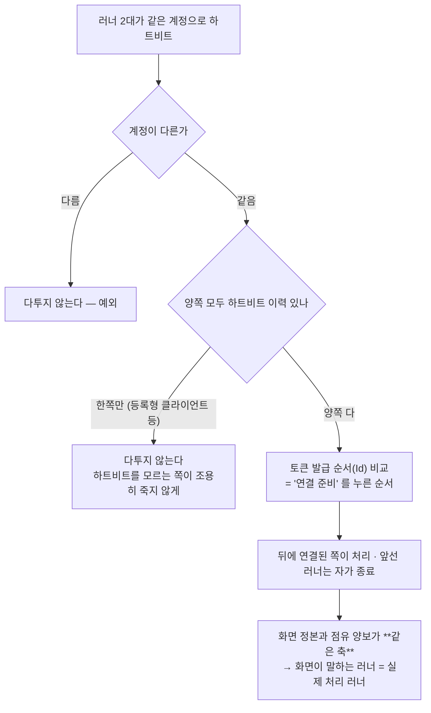

종전 축은 "배포본과 다른 빌드인가"(지문)였는데, **두 러너의 지문이 같으면 무력**했다. 지문은 이제 안내 라벨로만 남고, 판정은 토큰 발급 순서가 한다.

지문 판정은 **tri-state** 다. 러너가 「스스로 최신본을 받아 재기동할 줄 안다」(`self_update`)를 신고하면 낡음을 **일시적**으로 보고 조치 요구를 띄우지 않는다. 신고가 없으면 종전대로 「업데이트 필요」와 되돌아갈 명령을 보여 준다 — 자기 갱신을 **끈** 러너도 여기 포함되며, 두 경우 모두 사람이 조치해야 한다는 점에서 같다.

### 2.7 접지 지식 — get_task_context 5층

개인 AI 가 받는 접지 지식의 **주 경로**는 MCP `get_task_context` 번들이다. 전환 직후에는 클러스터 요약 **1개 층**만 실려, 관리 콘솔에서 큐레이션한 지식이 답변에 도달하지 않았다. 2026-09-01 에 5층을 더해 이었다.

> **2026-09-02 정정 — 「유일한 경로」가 아니다.** 5층으로 넓힌 뒤에도 라이브 기여는 **0** 이었다. 서버는 옳았고(같은 시각 같은 제품에서 그 도구를 직접 부르면 정의가 나온다) **외부 AI 가 그 도구를 한 번도 부르지 않았다** — 러너가 안내하는 도구 목록에 조사 도구만 있었기 때문이다. 즉 전환이 바꾼 것은 위치가 아니라 **성격**(무조건 주입 → 「부르면 받음」)이었으므로 `claim_request` **응답에 `kb_context`·`kb_notes` 를 실어 자동 주입으로 되돌렸다**(러너가 근거를 질문보다 앞에 놓고 「이미 조회된 것이니 다시 조사하지 마라」를 덧붙인다 · 값이 없으면 블록 자체를 생략 · 매칭은 가드 래퍼가 붙지 않은 원문으로 한다). ⚠ 배치가 러너 `compose_prompt` 에 있어 **구버전 러너에는 안 실린다** — 서버가 `hb.stale_build` 로 갱신을 안내하는 것이 그 경로다.

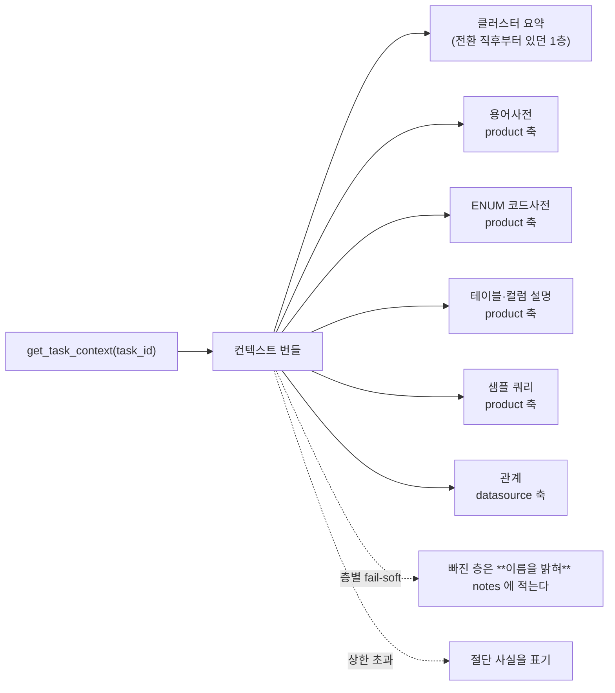

두 가지가 계약이다.

- **product scope 는 그 task 의 `ProductId` 로만 해석한다** — 주변 상태(현재 세션의 선택 등)를 읽으면 계정 경계를 침범한다.
- **도구 이름·인자는 불변** — 그래서 러너 재배포 없이 새 층이 닿는다.

### 2.8 도구 호출 1건이 지나는 6관문

feature-0041 의 표면은 순서가 고정돼 있다.

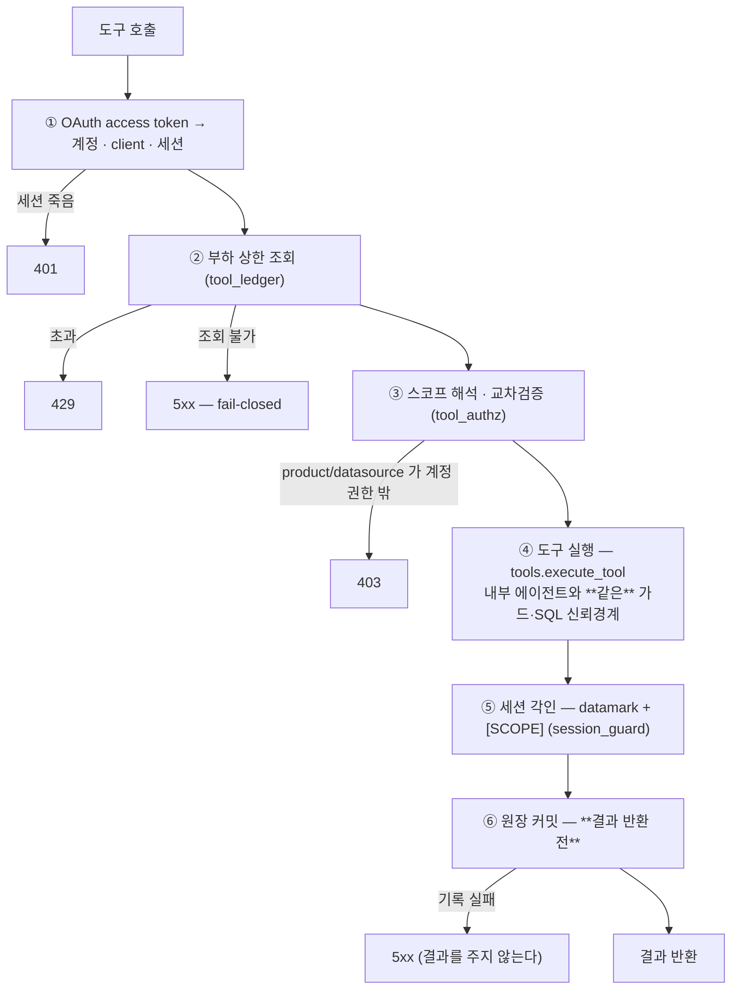

②와 ⑥이 **같은 원장**을 쓰는 것이 요점이다. 누적 상한의 원천이 원장이므로 기록이 실패하면 상한을 집행할 수 없고, 그때 결과를 주면 상한이 우회된다.

노출 도구는 **세션 계약 3종**(`open_task`·`get_task_context`·`submit_answer`) + **구조 조회 6종** + **브리지 3종**(`list_open_requests`·`wait_for_request`·`claim_request`) 이다. `execute_sql` 은 행수 예산·rate limit·추출 원장이 선행 조건이라 이 표면에 없다(P1). 쓰기·첨부·scratch 계열은 **영구 제외** — 세션 간 서버측 공유 상태를 만들지 않는다.

### 2.9 관리 콘솔·배치 작업 위임 (Kind 축)

2026-08-31 부터 **대화가 없는 작업**도 같은 대기열을 탄다. 테이블·점유 술어·lease·취소·원장을 나누지 않고 `Kind` 하나로만 갈랐다 — 나누면 다섯이 두 벌이 되고, 그 중 하나만 갈려도 "목록엔 없는데 제출은 되는" 결함이 돌아온다.

| 축 | 값 | 의미 |
|---|---|---|
| `Kind` | `chat` / `job` | **무엇을 하는 작업인가** |
| `Origin` | `web` / `external` / `batch` | **누가 열었나** (Kind 와 직교) |

현재 배선된 작업 종류(`JOB_SPECS` 레지스트리 — 한 곳에서 정의하고 모두가 읽는다):

| JobKind | 이름 | Origin | 응답 | 산출물 반영 |
|---|---|---|---|---|
| `metadata_suggest` | 메타데이터 자동완성(단건) | web | text | review (사람 검토 후 저장) |
| `metadata_bulk` | 메타데이터 자동완성(일괄) | web | json | review |
| `node_analysis` | 그래프 AI 능동 분석 | web | json | store (자동 기입) |
| `prompt_generate` | 시스템 프롬프트 자동작성 | web | text | review |
| `insight_summary` | 테이블 인사이트 배치 | batch | json | store |
| `cluster_label` | 클러스터 라벨링 | batch | json | store |

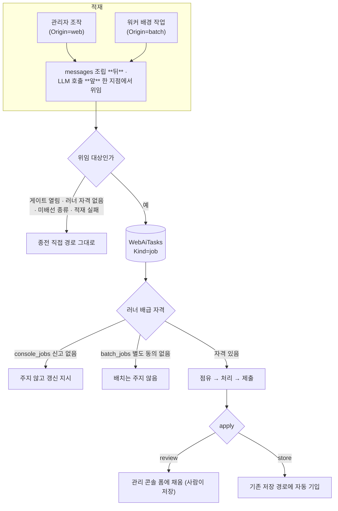

두 자격을 **나눈 이유**가 중요하다. `console_jobs` 는 능력 신고이고, `batch_jobs` 는 **별도 동의**다 — 배치는 그 사람이 요청한 적 없는 일이고 자기 계정 토큰을 태우므로, 능력이 있다고 동의한 것으로 볼 수 없다.

`wired: False` 는 **정직한 값**이다. 전 구간(적재 호출부·프롬프트 조립·산출물 반영)이 서기 전까지 `True` 로 적으면 화면은 "할 수 있다" 고 말하는데 실행 경로가 없어, 사용자가 눌러도 아무 일이 일어나지 않는다 — 이 feature 가 P0-M·P0-T 에서 두 번 밟은 함정이 정확히 그것이다.

배치 축에는 **상한 2개**가 있다: 대기열 상한 `BATCH_PENDING_MAX = 24`(배급 가능한 러너가 없어도 워커는 계속 도니까), 유효기간 `BATCH_TASK_MAX_AGE_MIN = 180`(배경 산출물은 재생성 가능하므로 오래된 요청을 붙들면 "대기 중" 이 영구 고착된다).

### 2.10 상태 기계 — task 의 일생

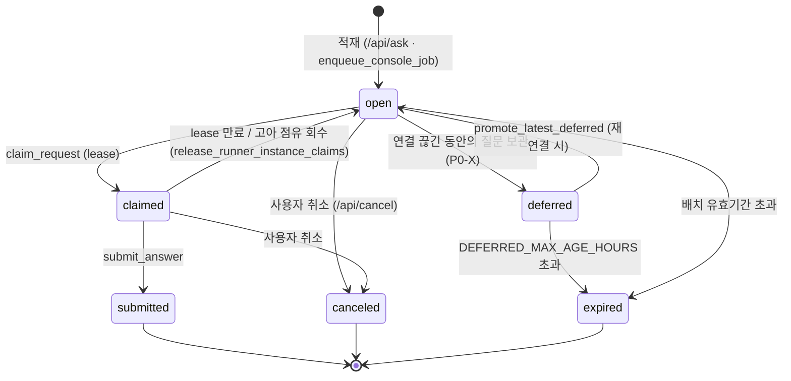

상태 술어는 `shared/bridge_tasks.py` **한 곳**에 있고 `ai_tools.py`(개인 AI 표면)와 `conversations.py`(웹 표면)가 **불러 쓴다**. 두 곳이 같은 질문에 각자 답하면 언제든 갈리고, **갈리는 순간 느슨한 쪽이 사용자가 보는 진실**이 된다 — 이 feature 는 그 부류의 결함을 이미 한 번 겪었다(P0-R: 연결 판정이 화면과 인증에서 두 벌이라 화면만 "연결 1건" 이라고 말했다).

### 2.11 배포가 왕복을 끊지 않는다 (feature-0045)

MCP 전송 표면은 **2 replica** 다(`ext-tool-mcp-a` / `ext-tool-mcp-b`, stateless, Caddy `ip_hash` LB). 배포는 one-at-a-time 롤링이고, 진행 중인 왕복은 드레인·게이트로 보호된다.

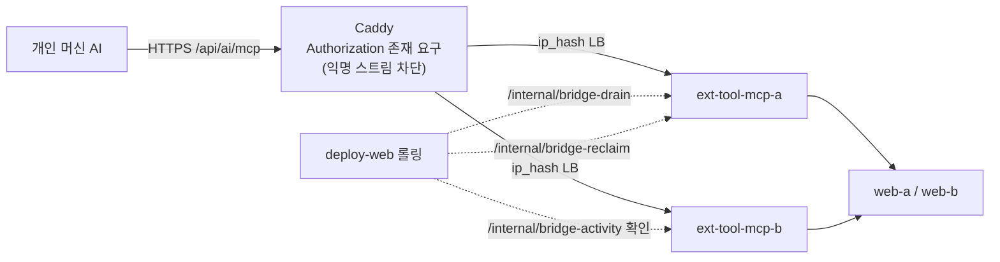

> **경계 주의**: MCP 전송 계층에는 verifier 가 없어, 익명 스트림 차단이 **Caddyfile 의 `/api/ai/mcp` 라우트**(feature-0006 자산)에서 `Authorization` 존재 요구로 집행된다. 인가 경계 한 조각이 feature-0006 에 거주한다 → [[../Architecture/Data-Flow#22-신뢰-경계-trust-boundary|Data-Flow §2.2]]

## 3. 특징

- **서버는 추론하지 않는다** — 도구·컨텍스트·데이터만 제공. 사용자 LLM 자격증명 보관 0.
- **하나의 대기열, 두 축** — `Kind`(chat/job) × `Origin`(web/external/batch). lease·취소·원장은 한 벌.
- **폴링 금지** — 블로킹 대기(`wait_for_request`)로 인지 즉시성과 환경 균일성을 동시에 얻는다.
- **자격은 신고로, 집행은 서버가** — 러너가 하트비트에 기능을 신고하고 배급 자격은 `ai_tools` 가 집행한다.
- **정직 표기 규율** — `wired: False`, 빠진 컨텍스트 층 이름 명시, 절단 표기. "할 수 있다고 말하고 안 되는" 상태를 구조적으로 금지.

## 4. 비교

### 4.1 feature-0041 `ask` vs feature-0041 원시 도구 표면 vs feature-0043 브리지

| | feature-0023 `ask` | feature-0041 원시 도구 | feature-0043 브리지 |
|---|---|---|---|
| 추론 주체 | **우리** LLM | 호출자 런타임 | 호출자 런타임 |
| 외부 AI 의 역할 | 질문하는 사람 | 도구 사용자 | **웹 사용자의 대리 추론자** |
| 트리거 | 외부가 호출 | 외부가 호출 | **웹 사용자가 질문** → 외부가 pull |
| 비용 귀속 | 서버 계정 | 호출자 | 호출자 |
| 현재 상태 | 게이트로 chat 차단 | 활성 | **주 접근 경로** |

### 4.2 push vs pull

| | MCP sampling (미채택) | 도구 기반 pull (채택) |
|---|---|---|
| 방향 | 서버 → 클라이언트 | 클라이언트 → 서버 |
| 표준 상태 | `2026-07-28` 에서 폐기 (SEP-2577) | 표준 도구 호출 |
| Claude Code | 미지원 | 지원 |
| 인지 즉시성 | push 라 즉시 | 블로킹 대기로 즉시 |

## 5. 평가

| 축 | 상태 |
|---|---|
| 강점 | 쿼터 독립 · 자격증명 무보관 · 단일 술어 정본 · 배포 무중단 왕복 |
| 마찰 | 연결이 전제 조건이라 미연결 사용자는 아무 답도 못 받는다(그래서 409 로 **아무것도 남기지 않고** 차단) |
| 미검증 | 취소 후 `submit_answer` 409 집행 — 러너가 취소를 인지해 제출 **전에** 하차하므로(설계대로) 그 경로에 닿지 않는다. 신호를 읽지 않는 등록형 AI 로만 재현된다 |
| 미실측 | macOS 의 URL 스킴 핸들러 등록 (WSL+Windows 조합만 실측 완료) |

## 6. 관련 문서

- [[Auth-and-Session|로그인·인증·세션]] — 연결 토큰의 세션 결속
- [[Security-Controls|보안 처리 과정]] — 도구 표면의 신뢰경계·인젝션 방어
- [[User-Journeys|사용자 화면 흐름]] — 연결 칩·대기 말풍선·실행 단계 패널
- [[../Architecture/Data-Flow|Architecture/Data-Flow]] — 시스템 수준 흐름과 축소된 Bedrock 경로

## 7. 둘러보기

- 상위: [[_Index|Flows MOC]]
- sibling: [[Auth-and-Session]] · [[Security-Controls]] · [[User-Journeys]] · [[Feature-Operations]]
- 관련 feature: [[../Features/feature-0043-external-llm-bridge]] · [[../Features/feature-0041-external-ai-tool-surface]] · [[../Features/feature-0045-zd-bridge-continuity]] · [[../Features/feature-0006-lan-proxy-access]]

## 8. 외부 link

- [MCP SEP-2577 — sampling 폐기](https://github.com/modelcontextprotocol/modelcontextprotocol)
- [anthropics/claude-code#1785 — sampling 미지원](https://github.com/anthropics/claude-code/issues/1785)

## 분류

`#wiki/article` · `#status/active` · `#confidence/high` · `#maturity/substantial`
