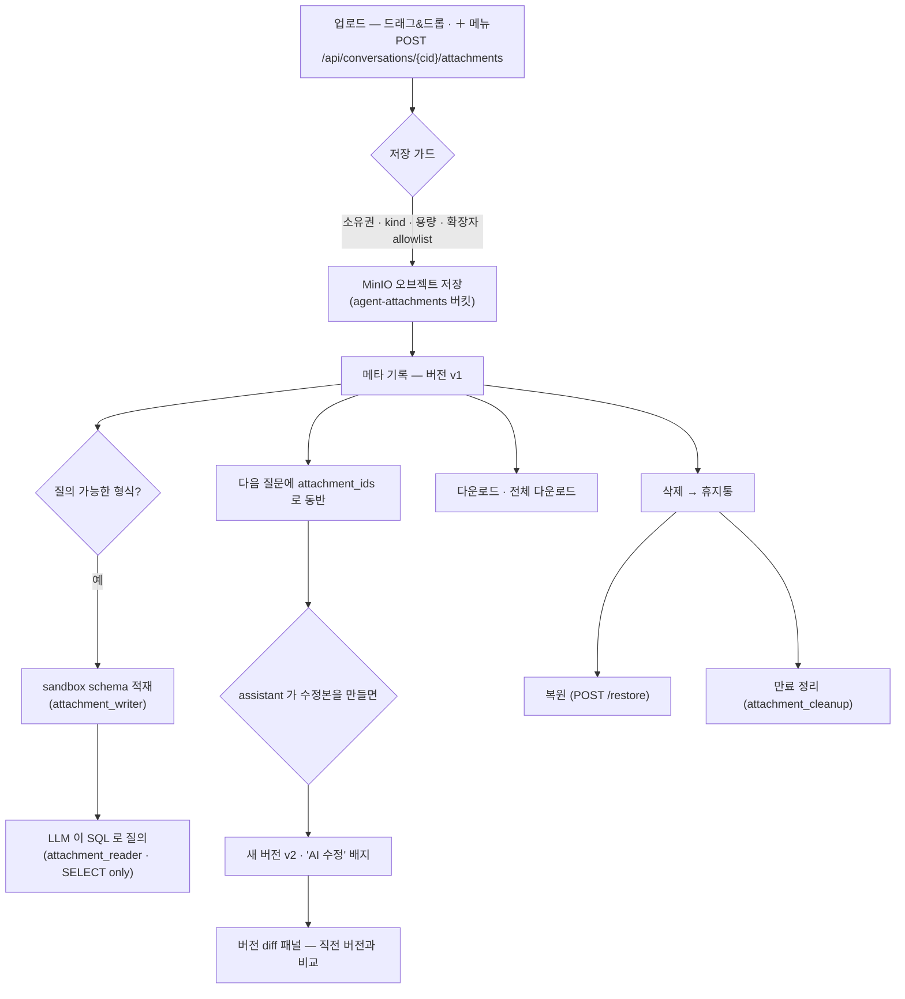
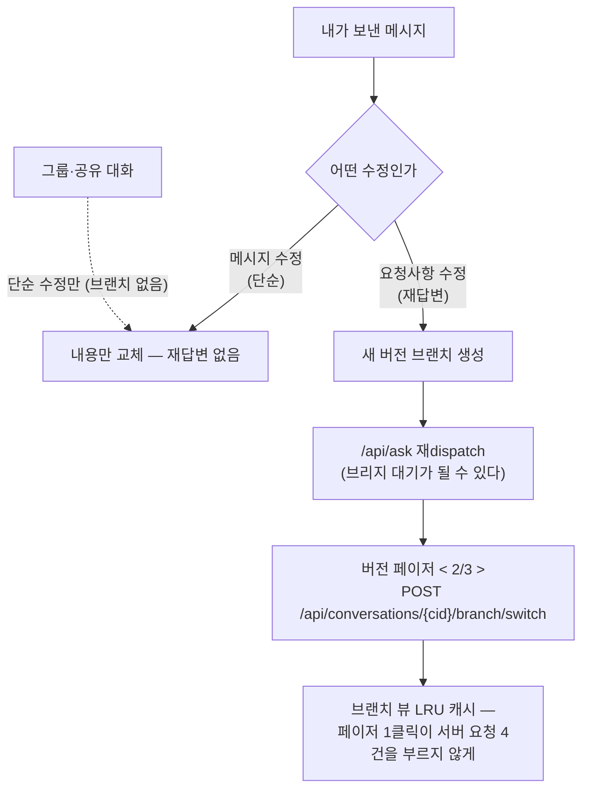
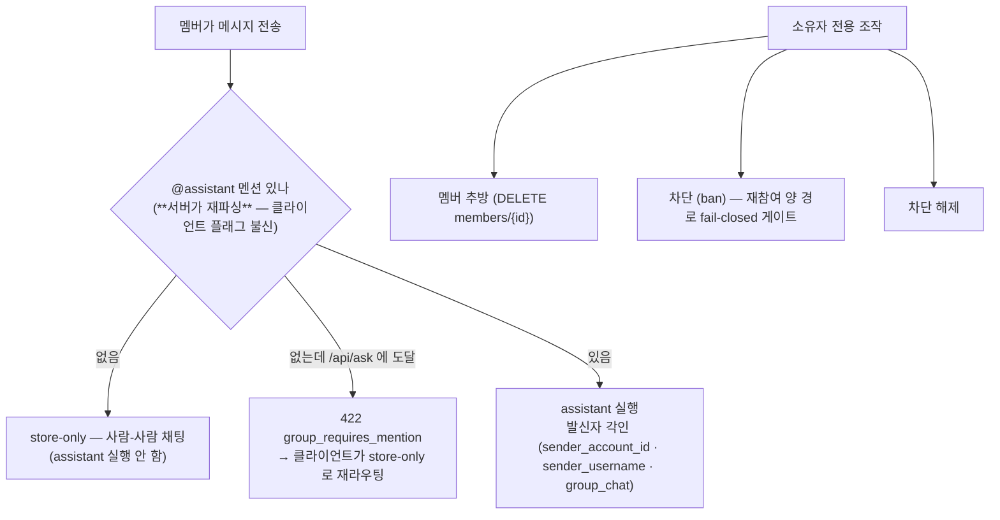
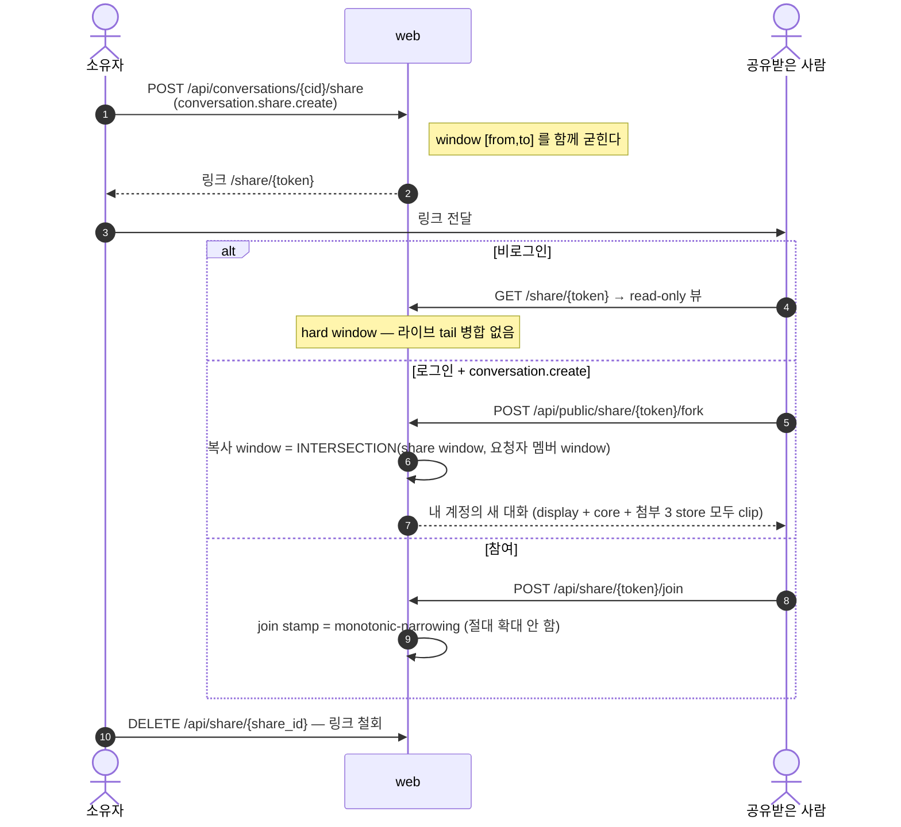
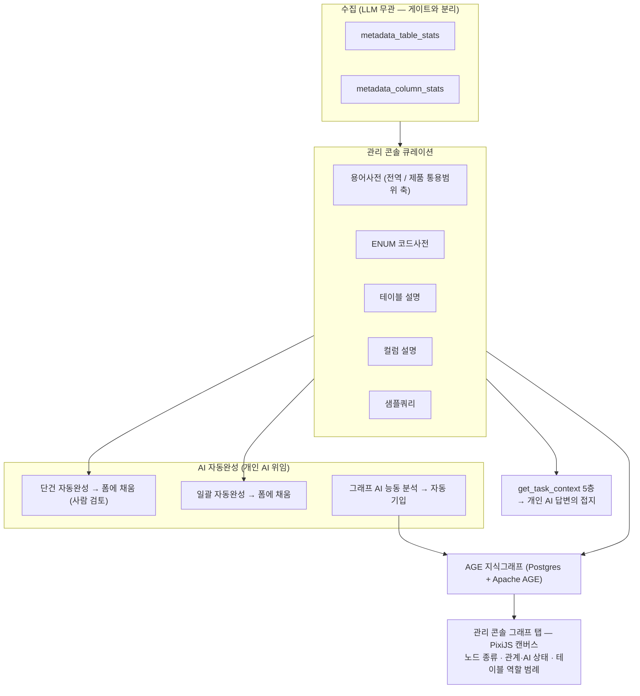
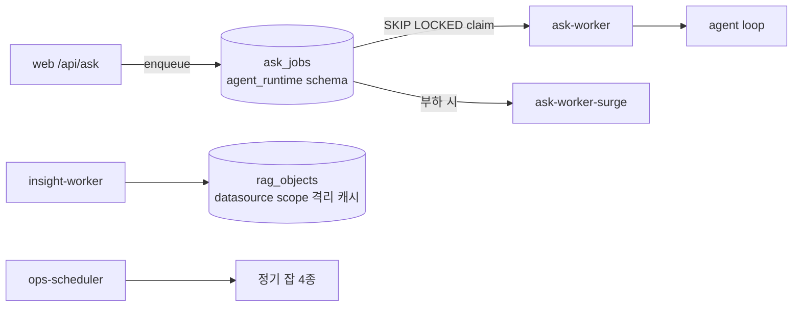
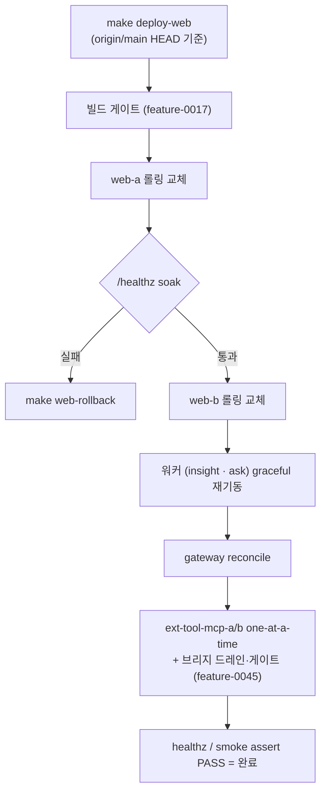

# Flows — 세부 기능 동작

| 항목 | 값 |
|---|---|
| 분류 | `#wiki/article` |
| 정본 | 각 절의 소유 feature `docs/FUNCTION.md` · [[../../docs/ROUTEMAP\|docs/ROUTEMAP.md]] (route → handler → auth) |
| 범위 | 첨부 · 메시지 편집/브랜치 · 그룹 대화 · 폴더 · 공유 · 검색 · 메타데이터/그래프 · 워커·큐 · 정기 잡 · 배포 |

## 목차

1. [개요](#1-개요)
2. [상세](#2-상세)
     - [2.1 첨부 파일 수명주기](#21-첨부-파일-수명주기)
     - [2.2 assistant 가 파일을 고치는 경로](#22-assistant-가-파일을-고치는-경로)
     - [2.3 메시지 편집과 재답변 브랜치](#23-메시지-편집과-재답변-브랜치)
     - [2.4 그룹 대화](#24-그룹-대화)
     - [2.5 폴더 (프로젝트)](#25-폴더-프로젝트)
     - [2.6 공유와 fork](#26-공유와-fork)
     - [2.7 대화 검색](#27-대화-검색)
     - [2.8 메타데이터 거버넌스와 지식그래프](#28-메타데이터-거버넌스와-지식그래프)
     - [2.9 실행 큐와 워커](#29-실행-큐와-워커)
     - [2.10 정기 잡 (ops-scheduler)](#210-정기-잡-ops-scheduler)
     - [2.11 무중단 배포](#211-무중단-배포)
3. [특징](#3-특징)
4. [평가](#4-평가)
5. [관련 문서](#5-관련-문서)
6. [둘러보기](#6-둘러보기)
7. [외부 link](#7-외부-link)
- [분류](#분류)

## 1. 개요

[[User-Journeys|사용자 화면 흐름]] 이 "무엇이 보이는가" 라면, 여기는 그 아래에서 **각 기능이 실제로 무엇을 하는가** 다. 45 개 feature 전부가 아니라, 사용자가 자주 만나거나 흐름이 비자명한 것들을 골랐다. 각 절의 정본은 해당 feature 의 `FUNCTION.md` 이며 본 문서는 그 흐름 mirror 다.

## 2. 상세

### 2.1 첨부 파일 수명주기



관련 route: `GET /api/attachments/{id}` · `/download` · `/source` · `/versions` · `/diff` · `POST /restore` · `DELETE`. sandbox 의 4 user 분리는 [[Security-Controls#27-첨부-sandbox--4-user-분리|Security §2.7]] 참조.

diff 패널의 UI 계약 두 가지가 실측으로 굳었다 — 표 레이아웃은 `colgroup` 이 필수이고(Chrome 이 `col` 퍼센트 `calc()` 를 무시), **스크롤 보존은 픽셀이 아니라 줄번호 앵커**로 한다(버전을 바꿀 때만 초기화).

### 2.2 assistant 가 파일을 고치는 경로

답변에 ` ```attachment-edit ` / ` ```attachment-new ` 블록이 실리면 그 내용은 채팅 본문이 아니라 **다운로드 첨부**(원본의 새 버전 / 새 파일)가 되어야 한다.


이 시퀀스는 `shared/attachment_write.py` **한 벌**이다. 원래 ask-worker 경로(`modules/ask.py`)에만 있었고 브리지 경로(`routers/ai_tools.py`)에는 **아예 없어서**, 개인 AI 가 관례대로 블록을 만들어 냈는데 서버가 처리하지 않아 **파일은 v1 그대로인 채 답변만 "수정했습니다" 라고 말하는** 거짓 성공이 났다(라이브 실측 2026-08-28).

두 번째 구현을 쓰는 대신 한 벌로 합친 이유: 저장 가드(소유권·kind·용량·확장자 allowlist)가 materialize 안에 있어서 **구현이 갈리면 가드도 갈리고, 갈리는 순간 느슨한 쪽이 사용자가 보는 진실**이 된다.

> 잔여: 동기 inproc 경로(`_ask_impl`)의 첨부 쓰기는 아직 세 번째 구현이다. 합치는 것은 별도 cycle.

### 2.3 메시지 편집과 재답변 브랜치



이 기능에는 실측된 함정이 하나 있다. 브랜치 체이닝이 대화 단위 `active_leaf` 를 **write 마다 다시 읽던 시절**, 동시 재답변이 겹치면 답변이 user 메시지의 형제로 붙어 **"내 메시지가 사라지고 답변만 쌓이는"** 것처럼 보였다. 수정은 **run 단위 thread-local 커서**로 갈랐고, 복구는 대화 스코프의 `LAG` UPDATE 로 했다.

### 2.4 그룹 대화



멘션 판정을 **서버에서 다시 하는 것**이 요점이다. 클라이언트의 send-routing 이 이미 store-only 로 보내지만, stale 클라이언트나 직접 API 호출이 `/api/ask` 에 도달하면 여기서 거부해 단일 실패점을 없앤다. 파서 자체가 고장나면 보수적으로 통과시킨다(기존 동작 유지).

### 2.5 폴더 (프로젝트)

| 동작 | route | 권한 |
|---|---|---|
| 목록 | `GET /api/folders` | `folder.list.own` |
| 생성·이름변경·삭제·복원 | `POST /api/folders` · `PATCH`/`DELETE /api/folders/{id}` · `POST /{id}/restore` | `folder.manage.own` |
| 대화 이동 | `PATCH /api/conversations/{cid}/folder` | `folder.manage.own` |

최대 깊이는 서버가 알려주는 `max_depth`(기본 4)를 따르고, 권한이 없거나 미부트스트랩이면 폴더 층만 사라진 채 정상 동작한다. 삭제에는 undo 가 붙는다.

### 2.6 공유와 fork



빈 교집합이면 400, 멤버 window 조회가 PG 오류면 500(fail-closed). bounded 멤버가 자기 window 밖으로 재공유하려 하면 403.

### 2.7 대화 검색

`GET /api/conversations` 는 `q` / `owner_id` / `product_id` / `date_from` / `date_to` / `cursor` 중 하나 이상이 오면 **검색 모드**로 전환된다. cross-account 검색은 admin/operator 의 감사 필요와 PII 보호 사이의 균형을 위해 별도 정책이 걸려 있다: 검색 표면 한정 · SQL safety · 성능 안전망 · **PII audit**(PIPA §29 준거) · UI 표면 제약. 상세는 [[../../docs/SECURITY|docs/SECURITY.md]] §8.

### 2.8 메타데이터 거버넌스와 지식그래프



큐레이션이 실제로 **답변에 도달하는 주 경로**가 `get_task_context` 라는 점이 중요하다 — 2026-09-02 부터는 점유 응답(`claim_request`)에 접지 근거를 함께 싣는 **자동 주입**이 더해져 「유일한 경로」가 아니다([[External-AI-Bridge#27-접지-지식--get_task_context-5층|Bridge §2.7]]). 그래프 동기화는 증분(30분)과 전량(04:17) 두 스케줄로 돌고, 호스트에 남아 있는 `bin/routine-backfill.sh` 와 **`flock` 으로 상호배제**된다.

### 2.9 실행 큐와 워커



| 워커 | 하는 일 |
|---|---|
| `ask-worker` / `-surge` | `ask_jobs` 를 `SKIP LOCKED` 로 집어 agent loop 실행. **web 재배포가 in-flight run 을 죽이지 않는다** |
| `insight-worker` | 데이터소스 scope(`engine+host+port` 해시)로 `rag_objects` 를 격리 캐시 → 완료율·DB별 파악내용 표면화 |
| `ops-scheduler` | 아래 §2.10 |

> `web` 의 in-process 실행(`AGENT_ASK_EXECUTION_MODE=inprocess`)도 롤백 옵션으로 남아 있으나, 운영은 큐(`=worker`)가 라이브다. 다만 [[External-AI-Bridge|브리지 전환]] 이후 대화 답변은 이 큐가 아니라 `WebAiTasks` 대기열을 탄다 — 큐는 게이트가 열린 경우와 브리지 비대상 경로에서 계속 쓰인다.

### 2.10 정기 잡 (ops-scheduler)

스케줄 정본은 crontab 이 아니라 **`docker-compose.yml` 의 `ops-scheduler` 환경변수**이고, 잡 로직은 이미지 안(`/app/scripts/ops_*.sh`)에 실린다.

| 시각 | 잡 |
|---|---|
| 03:00 | 플랫폼 논리 백업 |
| 03:30 | 백업 복원 리허설 |
| 매 30분 | AGE 메타데이터 그래프 증분 sync |
| 04:17 | 그래프 전량 sync |

호스트 root crontab 에서 옮겨온 이유가 설계 자체다. 기존 래퍼가 전부 `docker exec` 로 DB 컨테이너에 들어갔고 이 호스트는 docker 소켓 접근이 root 에만 있었다. **잡을 서비스 안으로 옮기면 docker 소켓 의존 자체가 사라져 root 권한 근거가 소멸**한다. 반대 방향(컨테이너에 docker 소켓 마운트)은 컨테이너 → 호스트 root 승격 경로라 채택하지 않았다.

### 2.11 무중단 배포



부분 범위 타깃도 있다 — `make deploy-web-only`(web+caddy) · `make deploy-workers`(insight/ask+gateway). 마이그레이션은 **expand/contract 필수**이고(`bin/migrate-lint.sh` 통과 의무), contract(DROP/RENAME/타입변경/NOT NULL)는 2-phase 또는 서명 annotation 을 요구한다 — 롤링 중 mixed-version 이 안전해야 하기 때문이다.

실측된 함정 둘:

- **`/healthz` soak 의 false-positive** — 동시에 무거운 PG 부하(그래프 sync)가 돌면 롤백으로 오판한다. web 재배포와 graph re-sync 를 순차화한다.
- **롤링 창의 캐시 오염** — 구 replica 가 신 `?v=` URL 에 구 콘텐츠를 200 으로 답하면 `immutable` 로 고착됐다. 엣지의 무조건 immutable 을 제거하고, upstream 이 `?v=` == `static/.asset-stamp` 일 때만 immutable, 불일치는 `no-store` 로 바꿔 근본 해소했다.

## 3. 특징

- **경로 공용 정본** — 답변을 만든 주체가 안이든 밖이든 첨부 쓰기 시퀀스는 한 벌(`shared/attachment_write.py`).
- **서버 재판정** — 그룹 멘션·권한·window 는 클라이언트 신호를 믿지 않고 서버가 다시 판정한다.
- **권한 근거 소멸시키기** — 정기 잡을 서비스로 옮겨 root 권한의 *근거 자체*를 없앴다(권한만 낮춘 것이 아니다).
- **롤링 안전을 스키마 규약으로** — expand/contract 가 mixed-version 창을 계약으로 만든다.

## 4. 평가

| 축 | 상태 |
|---|---|
| 강점 | 단일 정본 원칙이 반복 적용됨(첨부 쓰기·상태 술어·window 연산) · 배포가 in-flight 작업을 죽이지 않음 |
| 잔여 | 동기 inproc 경로의 첨부 쓰기 3번째 구현 미통합 |
| 운영 주의 | graph sync 와 web 배포의 순차화 · `flock` 상호배제 유지 |

## 5. 관련 문서

- [[User-Journeys|사용자 화면 흐름]] — 위 기능들이 화면에서 어떻게 보이는가
- [[Security-Controls|보안 처리 과정]] — 첨부 sandbox·공유 window 의 방어
- [[External-AI-Bridge|외부 AI 연계 동작]] — 콘솔 작업 위임과 접지 지식
- [[../Architecture/Data-Flow|Architecture/Data-Flow]] — 워커·큐의 시스템 배치

## 6. 둘러보기

- 상위: [[_Index|Flows MOC]]
- sibling: [[Auth-and-Session]] · [[External-AI-Bridge]] · [[Security-Controls]] · [[User-Journeys]]
- 관련 feature: [[../Features/feature-0019-message-editing]] · [[../Features/feature-0009-group-conversation]] · [[../Features/feature-0024-conversation-folders]] · [[../Features/feature-0016-metadata-graph]] · [[../Features/feature-0039-ops-scheduler]] · [[../Features/feature-0014-zero-downtime-deploy]]

## 7. 외부 link

- [Apache AGE — Cypher on PostgreSQL](https://age.apache.org/)
- [expand/contract 마이그레이션 패턴](https://martinfowler.com/bliki/ParallelChange.html)

## 분류

`#wiki/article` · `#status/active` · `#confidence/high` · `#maturity/substantial`
