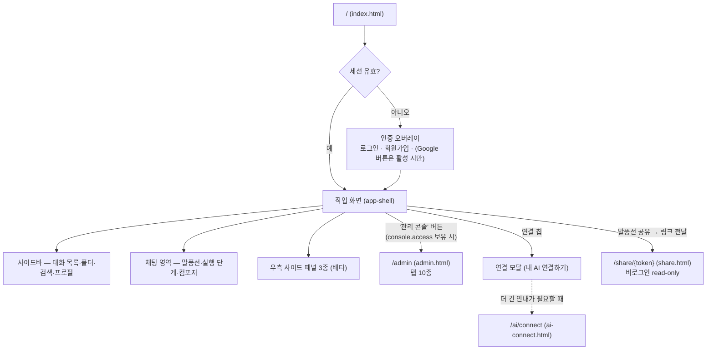
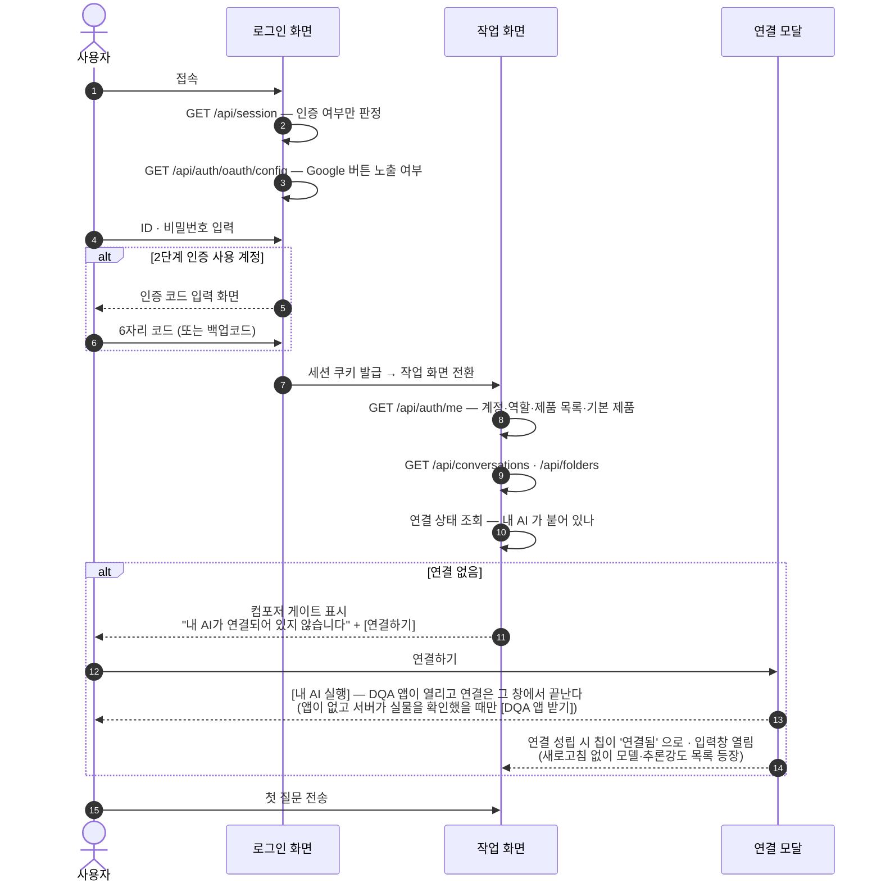
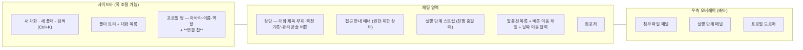
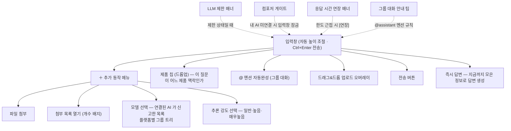
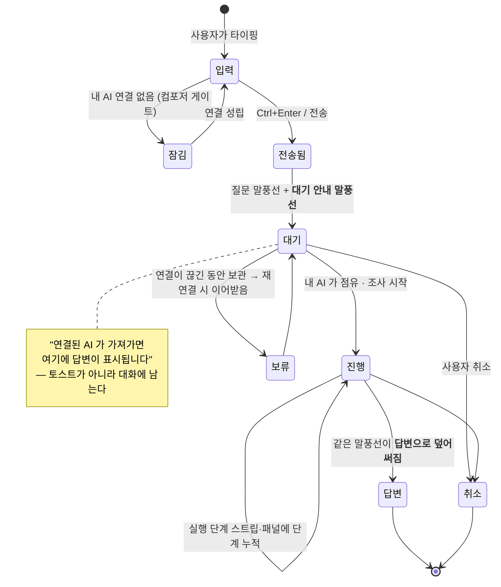
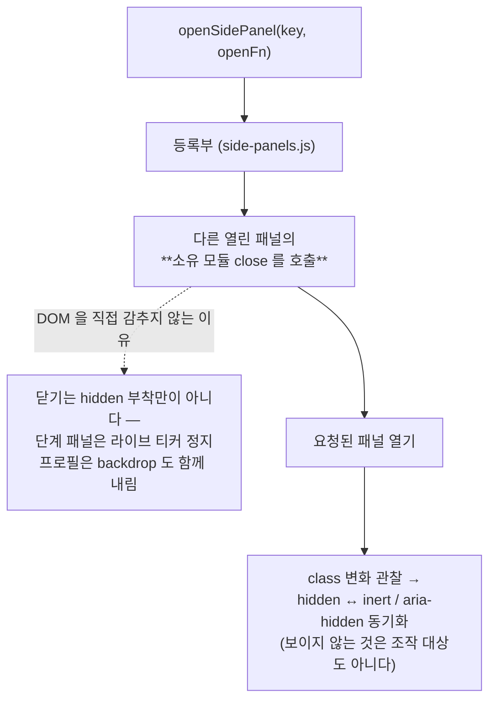
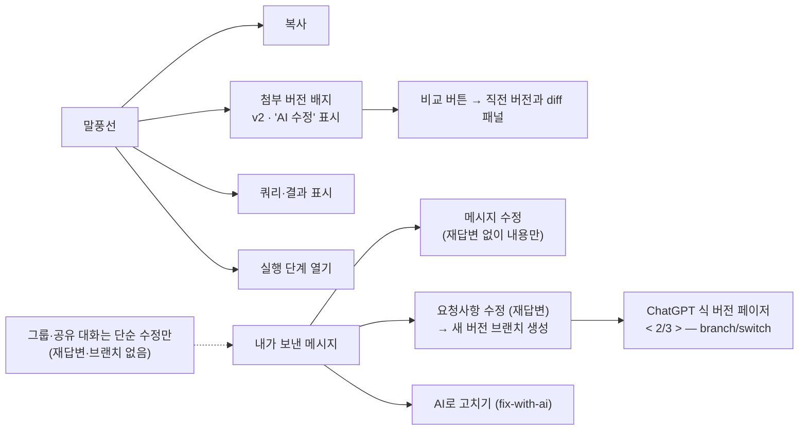
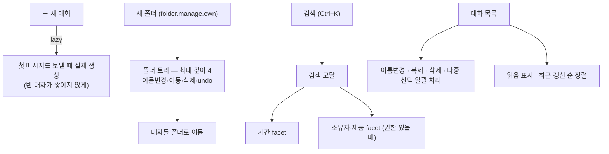
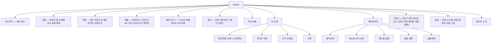
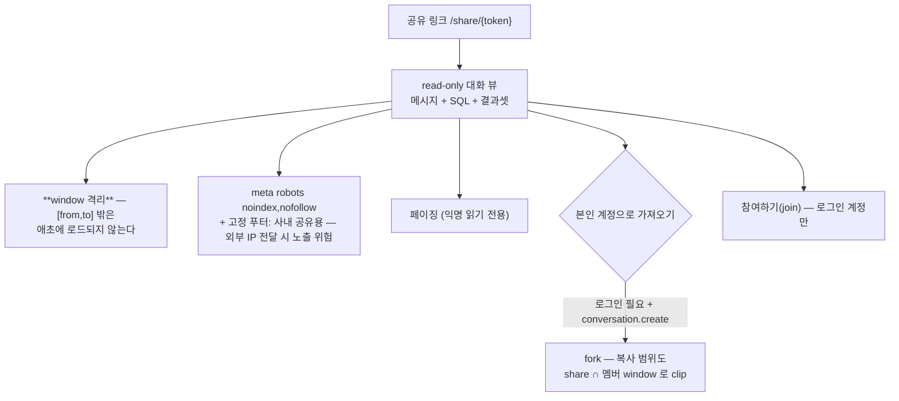

# Flows — 사용자 화면 흐름 (UI/UX)

| 항목 | 값 |
|---|---|
| 분류 | `#wiki/article` |
| 정본 | `unit/feature-0003-agent-web-ui/docs/FUNCTION.md` (웹 UI) · feature-0038 (프론트 모듈 분할) |
| 코드 | `src/static/index.html` (작업 화면) · `admin.html` (관리 콘솔) · `share.html` (공유 뷰) · `ai-connect.html` (연결 안내) · `static/app/*.js` (12 모듈) · `share-client-context.js` (공유 화면이 정본 브리지 모듈을 얹는 어댑터, 2026-09-08) |
| 시각검증 | `visual_verification_scope: always` — 화면 변경은 **실제 DQA 클라이언트(PB-0009)** 검증 후 완료 선언 (2026-09-08 ADR-20260908T024500 · 일반 Windows 브라우저 PB-0008 은 **보조 호환 경로**) |

## 목차

1. [개요](#1-개요)
2. [상세](#2-상세)
     - [2.1 화면 지도](#21-화면-지도)
     - [2.2 첫 진입 — 로그인부터 첫 질문까지](#22-첫-진입--로그인부터-첫-질문까지)
     - [2.3 작업 화면 3분할](#23-작업-화면-3분할)
     - [2.4 컴포저 — 질문을 보내는 자리](#24-컴포저--질문을-보내는-자리)
     - [2.5 질문 1건의 화면 상태 전이](#25-질문-1건의-화면-상태-전이)
     - [2.6 우측 사이드 패널 — 한 번에 하나만](#26-우측-사이드-패널--한-번에-하나만)
     - [2.7 말풍선에서 할 수 있는 것](#27-말풍선에서-할-수-있는-것)
     - [2.8 사이드바 — 대화·폴더·검색](#28-사이드바--대화폴더검색)
     - [2.9 프로필 패널](#29-프로필-패널)
     - [2.10 관리 콘솔](#210-관리-콘솔)
     - [2.11 공유 뷰 (비로그인)](#211-공유-뷰-비로그인)
     - [2.12 상태 안내의 원칙](#212-상태-안내의-원칙)
3. [특징](#3-특징)
4. [평가](#4-평가)
5. [관련 문서](#5-관련-문서)
6. [둘러보기](#6-둘러보기)
7. [외부 link](#7-외부-link)
- [분류](#분류)

## 1. 개요

일반 사용자에게 이 제품은 **채팅 화면 하나**다. 왼쪽에 대화 목록, 가운데에 말풍선, 아래에 입력창. 그런데 그 뒤에는 [[External-AI-Bridge|자기 컴퓨터의 AI 에 질문을 위임하는]] 구조가 있어서, 화면은 "AI 가 생각 중" 이 아니라 **"내 AI 가 아직 연결되지 않았다 / 가져가면 여기 답이 표시된다"** 를 상태에 맞게 말해야 한다. 본 문서는 사용자가 실제로 보는 것과 누를 수 있는 것을 화면 단위로 정리한다.

## 2. 상세

### 2.1 화면 지도

### 2.2 첫 진입 — 로그인부터 첫 질문까지

**입력창이 잠기는 것이 의도된 동작**이다. 연결 없이 보낸 질문은 아무도 가져가지 않으므로, 대기열에 올리지 않고 애초에 보내지 못하게 한다([[External-AI-Bridge#23-대화-질문-1건의-전체-왕복|409 + 아무것도 남기지 않음]]).

### 2.3 작업 화면 3분할

사이드바와 각 우측 패널은 **드래그로 폭을 조절**할 수 있고(더블클릭 시 기본 너비 복귀), 그 값은 유지된다.

### 2.4 컴포저 — 질문을 보내는 자리

- **모델 목록의 출처는 연결된 AI 자신**이다. 우리 표의 낡은 이름을 목록으로 쓰지 않고, 러너가 하트비트로 신고한 것만 보여준다 — 지정할 수 없는 것은 **보여주지 않는다**.
- 사용자가 고른 값은 **계정 기본값 + 대화별 override** 로 유지되며, **명시적으로 고른 것만** 기본값으로 기록된다(선택기가 보이면 항상 실려 오는 값으로 기본값을 덮어쓰지 않기 위해).
- 답변 본문에는 모델·추론등급 고지를 **싣지 않는다**. 반영되지 **않은** 지정에 대한 고지는 남는다.

### 2.5 질문 1건의 화면 상태 전이

전환 직후에는 대기 안내를 응답 본문으로만 돌려주고 대화에 저장하지 않았다. 프런트는 **저장된 이력**을 그리므로 화면에는 질문만 남았고 토스트는 몇 초 뒤 사라졌다 — 사용자에게는 "전송했는데 아무 일도 일어나지 않는" 상태였다(실제 제보). 그래서 대기 안내는 **말풍선으로 저장**되고, 답변이 오면 **같은 말풍선을 덮어쓴다**(말풍선 2개가 아니다).

### 2.6 우측 사이드 패널 — 한 번에 하나만

세 패널(`첨부 파일` · `실행 단계` · `프로필`)은 `position: fixed; right: 0` 으로 겹쳐 뜬다. 각자 `hidden` 만 벗기면 동시에 열릴 수 있고, 그때 **z-index 가 높은 하나만 보이면서 아래 패널이 열린 채 가려진다** — 사용자에게는 "닫았는데 다시 열려 있는" 상태로 보이고, 가려진 패널의 닫기 버튼은 클릭이 위 패널에 먹혀 접근 불가가 된다.

접근성 동기화의 **실효 대상은 앞의 둘**이다 — 첨부·단계 패널의 `.hidden` 은 화면 밖으로 밀려날 뿐(`transform: translateX(100%)`) 여전히 포커스 가능하고 `aria-live` 도 읽혔다. 프로필 드로어는 이미 `display:none` 이라 무해한 중복이다.

### 2.7 말풍선에서 할 수 있는 것

재답변도 `/api/ask` 를 재dispatch 하므로 **브리지 대기 상태가 될 수 있다** — 그때도 같은 대기 안내를 받는다. 재답변에 실리는 모델·추론 강도는 **화면에 보여준 값과 같아야 한다**(보여주지도 않은 값을 재답변에 실어 보내지 않는다).

### 2.8 사이드바 — 대화·폴더·검색

폴더 권한이 없거나 미부트스트랩이면 `state.folders` 가 빈 배열이 되고 **폴더 없이 정상 동작**한다(기능 소실이 아니라 폴더 층만 사라진다).

### 2.9 프로필 패널

| 섹션 | 내용 |
|---|---|
| 요약 | 아바타(변경·제거) · 이름 · 역할 · 가입/최근 로그인/권한 부여 시각 |
| 비밀번호 | 현재·새·확인 3필드 |
| 2단계 인증 | 설정·해제(해제는 비밀번호 재확인) · 백업코드 |
| 알림 | 멘션 알림 · 데스크톱 알림(브라우저 권한 상태 표시) |
| 화면 | 애니메이션 효과 선택 |
| 사용량 | 집계 단위·기간 선택 → 일별 누적 차트 + 모델별 도넛 |
| 시스템 프롬프트 | 제품별 내 지침 — 자동 작성 · 저장 · 비우기 |
| AI 작업 | 어떤 콘솔 작업을 내 AI 에 위임할지 (권한 있는 항목만 노출) |
| 릴리즈 노트 | 변경 이력 |
| 로그아웃 | 세션 + 파생 AI 연결 토큰 함께 폐기 |

### 2.10 관리 콘솔

`console.access` 권한이 있을 때만 상단에 버튼이 보인다. 탭은 권한에 따라 개별 노출된다.

메타데이터 탭의 **자동완성**(단건·일괄)과 설정 탭의 **프롬프트 자동작성**, 그래프 탭의 **AI 능동 분석**은 [[External-AI-Bridge#29-관리-콘솔배치-작업-위임-kind-축|같은 대기열로 개인 AI 에 위임]]된다. 위임 대상이 아니면(게이트 열림·러너 자격 없음·미배선 종류·적재 실패) 종전 직접 경로가 그대로 돌고, **미배선 종류는 사유와 함께 비활성**으로 보인다.

### 2.11 공유 뷰 (비로그인)

발신자 표시명은 표시 계층에서만 노출되고, 가려진 구간은 [[Security-Controls#210-공유창-window-격리|store 수준에서 물리적으로 배제]]된다.

### 2.12 상태 안내의 원칙

feature-0043 의 P0-G 가 정한 규율이 화면 전체에 적용된다.

| 원칙 | 나쁜 예 | 현재 |
|---|---|---|
| **사용자의 언어로** | "외부 AI 연결( /ai/connect )" · "MCP 를 지원하는 도구" | "내 AI 연결하기" · 실제 도구 이름(Claude Desktop, Claude Code) |
| **상태에 맞게** | 연결 여부와 무관하게 같은 문구 | 연결 없음 → "아직 연결되어 있지 않습니다 + [AI 연결하기]" / 연결 있음 → "가져가면 여기에 답변이 표시됩니다" |
| **한 번의 판정을 공유** | 화면·본문·토스트가 각자 판정 | `_account_has_connected_ai` 요청당 1회 — 저장 본문·응답·토스트가 같은 값을 쓴다 |
| **확신 없이 단정하지 않기** | 조회 실패 → "연결이 없습니다" | 조회 실패 → **연결됨으로 간주**(fail-open) — 이미 연결한 사용자에게 매번 설정하라고 떠들지 않는다 |
| **누를 수 없는 경로 문자열 금지** | `/ai/connect` 를 글자로 안내 | 링크·버튼으로 |
| **선택지를 사람에게 고르게 하지 않기** | "① 커넥터 등록 / ② 토큰 입력 중 택 1" | 한 덩어리 지시문 — 어느 방법이 되는지는 AI 가 판단 |
| **모르는 것을 정상이라 말하지 않기** (2026-09-03) | 러너 원장의 fail-open 초기값(`True`)이 그대로 화면에 나가 **미확인**을 「대기 중」으로 그렸다 | 3상태(`None` 미확인 · `True` 답을 받아냈다 · `False` 관측된 불가) — `ai_health()`(표시)와 `ai_blocked()`(게이트)를 별도 함수로 갈라, 칩이 「확인 중」(중립 회색)·「답할 수 없음」+사유로 나뉜다 |

문구를 고쳐도 **JS 가 잡는 DOM id 13개는 불변**이며 테스트로 고정돼 있다 — 문구 수정이 버튼을 죽이지 않게.

## 3. 특징

- **채팅 한 화면으로 수렴** — 제품 선택·모델 선택·첨부·멘션이 모두 컴포저 안에 있고 별도 설정 화면으로 나가지 않는다.
- **배타 오버레이 계약** — 우측 패널은 한 번에 하나, 닫기는 소유 모듈이 책임(티커 정지·backdrop 정리 포함).
- **대기가 대화에 남는다** — 사라지는 토스트가 아니라 말풍선이라, 나중에 열어도 무슨 일이 있었는지 보인다.
- **표시는 넓게, 거부는 서버가** — 프론트 권한 게이트는 display-permissive 이고 실제 403 은 백엔드가 낸다.
- **화면 변경은 실제 DQA 앱 검증 후 완료** — `visual_verification_scope: always` (**PB-0009**, 2026-09-08 ADR-20260908T024500). 일반 Windows 브라우저(PB-0008)는 보조 호환 경로이며 브라우저·Node·CLI PASS 를 앱 전체 PASS 로 합산하지 않는다.

## 4. 평가

| 축 | 상태 |
|---|---|
| 강점 | 상태별 문구 분기 · 단일 판정 공유 · 접근성(inert/aria-hidden) 동기화 · 폭 조절과 값 유지 |
| 마찰 | 「프로필 열린 상태에서 첨부 열기」는 backdrop 이 클릭을 먹어 실 브라우저 도달 불가 — jsdom 계약으로만 잠겨 있음 |
| 검증 한계 | HTML5 DnD 는 CDP native 재현 불가 → `draggable` 라이브 확인 + 합성 DragEvent 왕복으로 대체 |

## 5. 관련 문서

- [[External-AI-Bridge|외부 AI 연계 동작]] — 연결 칩·대기 말풍선의 뒷면
- [[Feature-Operations|세부 기능 동작]] — 첨부·편집·공유의 서버측 흐름
- [[Auth-and-Session|로그인·인증·세션]] — 로그인 화면과 프로필 패널의 계약
- [[../Features/feature-0003-agent-web-ui|feature-0003 카드]] — 웹 UI 정본 포인터

## 6. 둘러보기

- 상위: [[_Index|Flows MOC]]
- sibling: [[Auth-and-Session]] · [[External-AI-Bridge]] · [[Security-Controls]] · [[Feature-Operations]]
- 관련 feature: [[../Features/feature-0038-frontend-modularization]] · [[../Features/feature-0024-conversation-folders]] · [[../Features/feature-0019-message-editing]] · [[../Features/feature-0008-windows-browser-testing]]

## 7. 외부 link

- [WAI-ARIA — inert 와 aria-hidden](https://developer.mozilla.org/en-US/docs/Web/HTML/Global_attributes/inert)

## 분류

`#wiki/article` · `#status/active` · `#confidence/high` · `#maturity/substantial`
