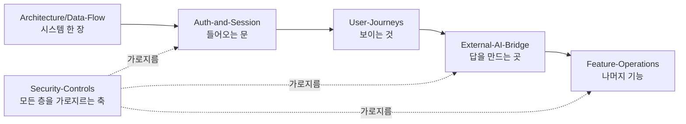

# Flows — 기능 동작 순서도 MOC

| 항목 | 값 |
|---|---|
| 분류 | `#wiki/index` |
| vault role | MOC — 기능별 동작 순서도의 입구 |
| 정본 | [[../../docs/ARCHITECTURE\|docs/ARCHITECTURE.md]] · [[../../docs/SECURITY\|docs/SECURITY.md]] · [[../../docs/ROUTEMAP\|docs/ROUTEMAP.md]] · `unit/<id>/docs/FUNCTION.md` |
| diagram 유형 | mermaid flowchart · sequenceDiagram · stateDiagram |
| 상위 | [[../Architecture/Data-Flow\|Architecture/Data-Flow]] (시스템 수준 흐름) |

## 목차

1. [개요](#1-개요)
2. [상세](#2-상세)
     - [2.1 문서 목록](#21-문서-목록)
     - [2.2 읽는 순서](#22-읽는-순서)
     - [2.3 Data-Flow 와의 역할 분담](#23-data-flow-와의-역할-분담)
3. [관련 문서](#3-관련-문서)
4. [둘러보기](#4-둘러보기)
5. [외부 link](#5-외부-link)
- [분류](#분류)

## 1. 개요

[[../Architecture/Data-Flow|Architecture/Data-Flow]] 가 **시스템 수준의 한 장짜리 흐름**(요청 → 엣지 → 웹 → 큐 → 에이전트 → 저장소)을 그린다면, 본 `Flows/` 는 그 아래 층 — **개별 기능 하나가 시작부터 끝까지 무엇을 지나는가** 를 순서도로 펼친다. 로그인 한 번, 질문 한 번, 첨부 한 개가 어느 관문을 어떤 순서로 통과하고, 어디서 막히며, 사용자 화면에는 그 사이 무엇이 보이는지를 담는다.

정본은 언제나 `docs/` 와 `unit/<id>/docs/` 다. 본 영역은 그 정본들에 흩어져 있는 흐름을 **한 축(=사용자 행위)으로 다시 꿴 mirror** 이며, 충돌 시 정본이 이긴다.

## 2. 상세

### 2.1 문서 목록

| 문서 | 다루는 축 | 대표 순서도 |
|---|---|---|
| [[Auth-and-Session\|로그인·인증·세션]] | 가입 → 로그인 → 2단계 인증 → 세션 수명 → 권한 판정 → 로그아웃 | 2단계 로그인 분기 · 세션 슬라이딩 만료 · RBAC DI 사슬 |
| [[External-AI-Bridge\|외부 AI 연계 동작]] | 서버 LLM 차단 → 대기 작업 적재 → 개인 AI 점유 → 답변 반영 (+ 관리 콘솔 위임) | pull 브리지 전체 왕복 · 러너 우선순위 · 도구 6관문 |
| [[Security-Controls\|보안 처리 과정]] | 신뢰 경계 → RBAC → SQL 3축 가드 → 자격증명 봉인 → 감사 체인 → 인젝션 방어 → 공유창 격리 | 요청 1건의 보안 관문 사슬 · SQL 가드 판정 트리 |
| [[User-Journeys\|사용자 화면 흐름 (UI/UX)]] | 일반 사용자가 실제로 보는 화면·조작·피드백 | 첫 진입 → 질문 → 대기 → 답변 · 사이드 패널 상호배타 · 관리 콘솔 탭 지도 |
| [[Feature-Operations\|세부 기능 동작]] | 첨부·메시지 편집·그룹 대화·폴더·공유·검색·메타데이터·워커·배포 | 첨부 수명주기 · 재답변 브랜치 · 공유 윈도우 fork · 워커 큐 |

### 2.2 읽는 순서

처음 오는 사람은 `Data-Flow → User-Journeys` 만 읽어도 제품이 무엇을 하는지 잡힌다. 구현에 손대는 사람은 `Auth-and-Session → External-AI-Bridge → Security-Controls` 순이 빠르다.

### 2.3 Data-Flow 와의 역할 분담

| | [[../Architecture/Data-Flow\|Data-Flow]] | 본 `Flows/` |
|---|---|---|
| 축 | 컴포넌트 (누가 누구를 부르나) | 사용자 행위 (한 동작이 무엇을 지나나) |
| 입도 | 서비스·컨테이너 | 엔드포인트·함수·화면 요소 |
| 답하는 질문 | "이 시스템은 어떻게 생겼나" | "이 기능은 어떻게 도나" |
| 신뢰 경계 | 경계 **목록** | 경계 **통과 순서**와 실패 시 거동 |

## 3. 관련 문서

- [[../Architecture/Data-Flow|Architecture/Data-Flow]] — 시스템 수준 데이터 흐름
- [[../Architecture/Overview|Architecture/Overview]] — 4-layer 책임 분리
- [[../Features/_Index|Features MOC]] — feature 카드 (기능별 정본 포인터)
- [[../../docs/ROUTEMAP|docs/ROUTEMAP.md]] — route → handler → auth 색인 (정본)

## 4. 둘러보기

- 상위: [[../Index|Wiki Index]]
- 하위: [[Auth-and-Session]] · [[External-AI-Bridge]] · [[Security-Controls]] · [[User-Journeys]] · [[Feature-Operations]]
- sibling: [[../Architecture/Overview]] · [[../Architecture/Data-Flow]] · [[../Architecture/Module-Map]]

## 5. 외부 link

- 없음

## 분류

`#wiki/index` · `#status/active` · `#confidence/high` · `#maturity/substantial`
